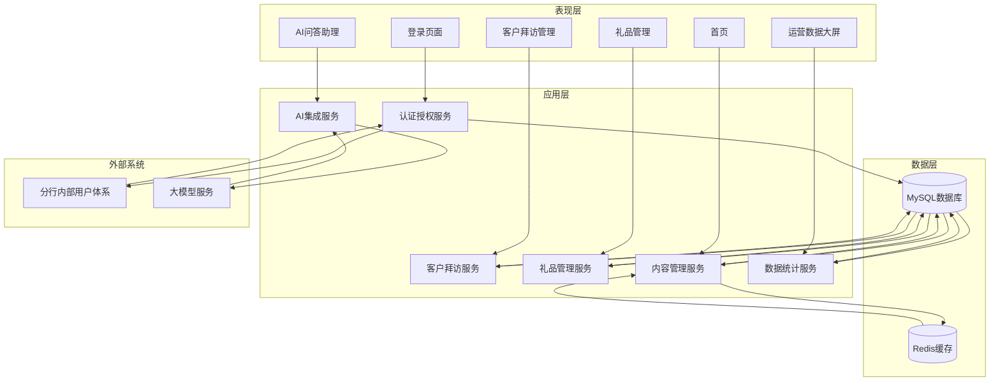

# 组件图

## 1. 系统组件概览

系统采用分层架构设计，各组件之间通过明确的接口进行交互，确保组件之间的低耦合和高内聚。组件图展示了系统的主要组件、组件之间的依赖关系以及与外部系统的交互。

## 2. 组件图

## 3. 组件详细描述

### 3.1 表现层组件

| 组件名称 | 职责描述 | 主要功能 |
|----------|----------|----------|
| 登录页面 | 提供用户登录界面 | 账号密码输入、登录验证、错误提示 |
| 首页 | 系统主入口，展示关键信息 | 轮播图展示、新闻列表、功能导航、用户信息 |
| 客户拜访管理 | 客户拜访记录的管理界面 | 拜访记录列表、新增拜访记录、编辑拜访记录、拜访记录查询 |
| 礼品管理 | 礼品申请和审批的管理界面 | 礼品申请列表、新增礼品申请、礼品审批、礼品台账 |
| 运营数据大屏 | 运营数据的可视化展示 | 关键指标展示、趋势分析、多维度统计 |
| AI问答助理 | 提供AI咨询服务的侧边栏 | 问题输入、回答展示、对话历史记录 |

### 3.2 应用层组件

| 组件名称 | 职责描述 | 主要功能 |
|----------|----------|----------|
| 认证授权服务 | 处理用户认证和权限控制 | 登录验证、Session管理、角色权限检查 |
| 客户拜访服务 | 处理客户拜访相关业务逻辑 | 拜访记录的增删改查、权限控制、数据验证 |
| 礼品管理服务 | 处理礼品申请和审批的业务逻辑 | 礼品申请的提交、审批流程管理、礼品台账查询 |
| 内容管理服务 | 处理首页内容的管理 | 轮播图的增删改查、新闻的发布和管理、内容缓存 |
| 数据统计服务 | 处理运营数据的统计分析 | 数据聚合、指标计算、图表数据生成 |
| AI集成服务 | 处理与大模型服务的集成 | 问题转发、回答处理、会话管理 |

### 3.3 数据层组件

| 组件名称 | 职责描述 | 主要功能 |
|----------|----------|----------|
| MySQL数据库 | 存储系统的结构化数据 | 数据持久化、事务处理、复杂查询 |
| Redis缓存 | 缓存热点数据 | 提高查询性能、减轻数据库压力、存储临时数据 |

### 3.4 外部系统

| 系统名称 | 职责描述 | 交互方式 |
|----------|----------|----------|
| 分行内部用户体系 | 提供用户账号和认证信息 | API调用 |
| 大模型服务 | 提供AI问答能力 | API调用 |

## 4. 组件交互流程

### 4.1 登录流程

1. 用户在登录页面输入账号密码
2. 登录页面调用认证授权服务进行验证
3. 认证授权服务与分行内部用户体系交互，验证用户身份
4. 验证成功后，认证授权服务在数据库中创建Session
5. 用户登录成功，跳转至首页

### 4.2 客户拜访记录创建流程

1. 客户经理在客户拜访管理界面填写拜访记录
2. 客户拜访管理组件调用客户拜访服务
3. 客户拜访服务验证用户权限和数据完整性
4. 客户拜访服务将拜访记录存储到MySQL数据库
5. 系统返回创建成功提示

### 4.3 礼品申请审批流程

1. 客户经理提交礼品申请
2. 礼品管理组件调用礼品管理服务
3. 礼品管理服务将申请存储到MySQL数据库，状态设为"待审批"
4. 审批人员在礼品审批界面查看待审批申请
5. 审批人员提交审批结果
6. 礼品管理服务更新申请状态和审批信息
7. 系统通知申请人审批结果

### 4.4 运营数据统计流程

1. 用户访问运营数据大屏
2. 运营数据大屏组件调用数据统计服务
3. 数据统计服务从MySQL数据库中提取原始数据
4. 数据统计服务根据选定的时间维度进行数据聚合和计算
5. 数据统计服务生成图表数据并返回给前端
6. 运营数据大屏使用ECharts展示可视化图表

### 4.5 AI问答流程

1. 用户在AI问答助理中输入问题
2. AI问答助理组件调用AI集成服务
3. AI集成服务将问题转发给大模型服务
4. 大模型服务生成回答并返回给AI集成服务
5. AI集成服务处理回答并返回给前端
6. AI问答助理展示回答给用户

## 5. 组件依赖关系

| 组件 | 依赖组件 | 依赖类型 |
|------|----------|----------|
| 登录页面 | 认证授权服务 | 强依赖 |
| 首页 | 内容管理服务 | 强依赖 |
| 客户拜访管理 | 客户拜访服务 | 强依赖 |
| 礼品管理 | 礼品管理服务 | 强依赖 |
| 运营数据大屏 | 数据统计服务 | 强依赖 |
| AI问答助理 | AI集成服务 | 强依赖 |
| 认证授权服务 | 分行内部用户体系、MySQL数据库 | 强依赖 |
| 客户拜访服务 | MySQL数据库 | 强依赖 |
| 礼品管理服务 | MySQL数据库 | 强依赖 |
| 内容管理服务 | MySQL数据库、Redis缓存 | 强依赖（数据库）、弱依赖（缓存） |
| 数据统计服务 | MySQL数据库 | 强依赖 |
| AI集成服务 | 大模型服务 | 强依赖 |

## 6. 组件设计原则

- **单一职责原则**：每个组件只负责一个明确的功能领域
- **接口隔离原则**：组件之间通过明确的接口进行交互，避免不必要的依赖
- **依赖倒置原则**：高层组件不依赖低层组件，而是依赖抽象接口
- **开闭原则**：组件设计应便于扩展，而不是修改现有代码
- **高内聚低耦合**：组件内部功能紧密相关，组件之间依赖关系简单

## 7. 组件扩展考虑

系统设计考虑了未来的扩展性，主要体现在以下几个方面：

- 表现层组件采用模块化设计，便于新增功能模块
- 应用层服务之间通过接口交互，便于替换或扩展单个服务
- 数据层支持水平扩展，可根据业务需求增加数据库节点
- 外部系统集成采用松耦合设计，便于替换或增加新的外部系统
- AI集成服务设计为独立组件，便于后续更换或扩展AI能力

这种组件化设计使系统能够灵活应对业务需求的变化，便于后续功能扩展和技术升级。