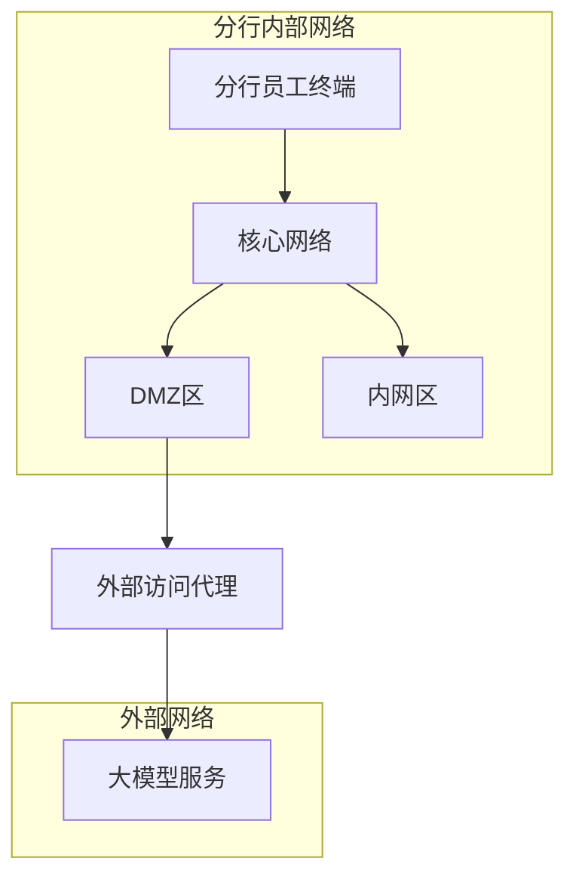
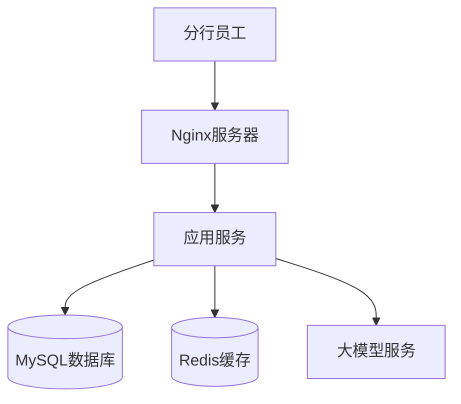
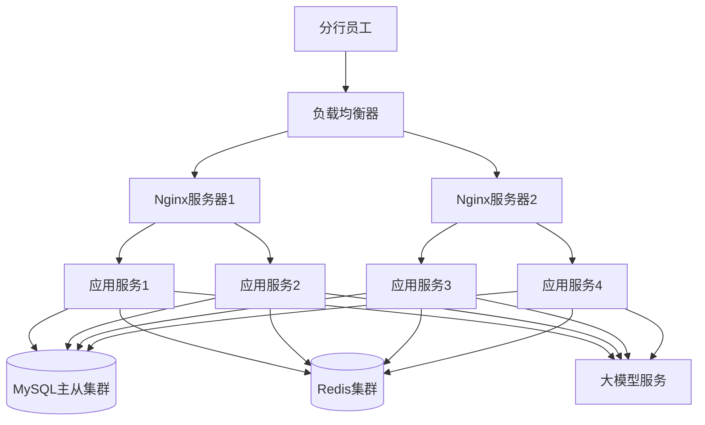

# 部署假设

## 1. 部署环境概述

系统将部署在招财银行北京分行内部网络环境中，作为分行内部运营支撑系统，仅供分行员工使用。部署环境应具备良好的安全性、可靠性和性能，以确保系统稳定运行。

## 2. 网络环境假设

### 2.1 网络拓扑

### 2.2 网络假设

- 系统部署在分行内部网络中，不直接暴露给外部互联网
- 分行内部网络已建立完善的网络安全防护体系，包括防火墙、入侵检测系统等
- 网络带宽充足，能够满足系统正常运行和外部API调用需求
- 网络延迟低，确保系统各组件之间的交互响应迅速

## 3. 硬件环境假设

### 3.1 服务器配置

| 服务器类型 | 配置要求 | 用途 |
|------------|----------|------|
| 应用服务器 | CPU: 8核+   内存: 16GB+   磁盘: 500GB+ SSD | 部署前端应用和后端服务 |
| 数据库服务器 | CPU: 16核+   内存: 32GB+   磁盘: 1TB+ SSD | 部署MySQL数据库 |
| 缓存服务器 | CPU: 4核+   内存: 8GB+   磁盘: 100GB+ SSD | 部署Redis缓存 |
| 备份服务器 | CPU: 8核+   内存: 16GB+   磁盘: 2TB+ HDD | 数据备份和恢复 |

### 3.2 硬件假设

- 所有服务器均为分行内部自有或租用的物理服务器或虚拟机
- 服务器硬件配置可根据实际用户量和业务需求进行调整
- 服务器部署在分行专用机房，具备良好的物理安全防护和环境监控
- 服务器电源供应稳定，配备UPS和发电机等备用电源设备

## 4. 软件环境假设

### 4.1 操作系统

| 服务器类型 | 操作系统 | 版本要求 |
|------------|----------|----------|
| 应用服务器 | Linux | CentOS 7.6+ 或 Ubuntu 20.04+ |
| 数据库服务器 | Linux | CentOS 7.6+ 或 Ubuntu 20.04+ |
| 缓存服务器 | Linux | CentOS 7.6+ 或 Ubuntu 20.04+ |
| 备份服务器 | Linux | CentOS 7.6+ 或 Ubuntu 20.04+ |

### 4.2 中间件和数据库

| 组件类型 | 软件名称 | 版本要求 | 用途 |
|----------|----------|----------|------|
| Web服务器 | Nginx | 1.18+ | 前端资源托管和反向代理 |
| 应用容器 | Tomcat | 9.0+ 或 Docker | 后端服务部署 |
| 数据库 | MySQL | 8.0+ | 数据存储和管理 |
| 缓存 | Redis | 6.0+ | 热点数据缓存 |
| 监控工具 | Prometheus + Grafana | 最新稳定版 | 系统监控和告警 |
| 日志管理 | ELK Stack | 最新稳定版 | 日志收集和分析 |

### 4.3 软件假设

- 所有软件均使用稳定版本，优先选择开源软件
- 软件安装和配置符合分行内部安全规范
- 定期更新软件版本，修复安全漏洞
- 配置适当的软件参数，优化系统性能

## 5. 部署架构

### 5.1 单节点部署

适合系统初期部署，用户量较少的场景：

### 5.2 集群部署

适合系统成熟阶段，用户量较大的场景：

### 5.3 部署假设

- 系统初期采用单节点部署，随着用户量增加可升级为集群部署
- 数据库采用主从复制架构，确保数据可靠性和读取性能
- 缓存采用集群部署，提高缓存容量和可靠性
- 所有组件均部署在同一数据中心，避免跨地域部署的网络延迟问题

## 6. 安全假设

### 6.1 网络安全

- 系统部署在分行内部网络，通过防火墙限制外部访问
- 仅开放必要的网络端口，关闭所有不必要的服务和端口
- 采用VPN或专线连接外部系统，确保数据传输安全

### 6.2 系统安全

- 所有服务器均安装杀毒软件和入侵检测系统
- 定期进行安全扫描和漏洞修复
- 采用最小权限原则配置用户权限
- 实现完善的日志审计机制，记录系统操作和访问日志

### 6.3 数据安全

- 数据库数据加密存储，保护敏感数据
- 定期进行数据备份，包括全量备份和增量备份
- 备份数据存储在独立的备份服务器上，确保数据可靠性
- 建立数据恢复机制，能够在数据丢失时快速恢复

## 7. 监控和维护假设

### 7.1 监控假设

- 部署完善的系统监控体系，包括服务器监控、应用监控和数据库监控
- 监控指标包括CPU使用率、内存使用率、磁盘空间、网络流量、响应时间等
- 设置合理的告警阈值，及时发现和处理系统异常
- 建立监控仪表盘，实时展示系统运行状态

### 7.2 维护假设

- 制定完善的系统维护计划，包括日常维护、定期维护和应急维护
- 定期进行系统性能优化和容量规划
- 建立故障应急预案，能够在系统故障时快速响应和恢复
- 维护人员具备足够的技术能力和经验，能够处理各种系统问题

## 8. 外部系统集成假设

### 8.1 分行内部用户体系集成

- 分行内部已建立完善的用户体系，包括用户账号、密码和角色信息
- 系统通过API与分行内部用户体系集成，实现账号密码登录
- 用户体系API提供稳定可靠的认证服务

### 8.2 大模型服务集成

- 外部大模型服务提供稳定的API接口，支持高并发请求
- 大模型服务响应时间在可接受范围内（<2秒）
- 大模型服务具备良好的安全性和隐私保护机制
- 分行内部已建立外部API调用的安全审核机制

## 9. 部署流程假设

### 9.1 部署流程

1. 环境准备：配置服务器硬件和软件环境
2. 应用部署：部署前端应用和后端服务
3. 数据库部署：初始化数据库和导入基础数据
4. 缓存部署：配置Redis缓存
5. 系统集成：连接外部系统和服务
6. 测试验证：进行系统功能测试和性能测试
7. 上线运行：系统正式上线，提供服务

### 9.2 部署工具

- 使用自动化部署工具（如Jenkins、Ansible等）实现持续集成和持续部署
- 采用容器化技术（如Docker、Kubernetes）简化部署和管理
- 建立部署脚本和文档，确保部署过程可重复和可追溯

## 10. 容灾假设

### 10.1 容灾策略

- 数据层面：定期备份数据库和关键配置，确保数据可恢复
- 系统层面：采用高可用架构，避免单点故障
- 网络层面：确保网络连接的冗余性，避免网络故障导致系统不可用

### 10.2 容灾假设

- 分行内部已建立完善的容灾体系，能够在发生重大故障时提供备用环境
- 系统设计考虑了容灾需求，能够快速切换到备用环境
- 制定了详细的容灾恢复计划，明确恢复流程和责任人

## 11. 总结

系统部署假设基于分行内部网络环境和现有IT基础设施，确保系统能够安全、稳定、高效地运行。这些假设将指导系统的详细部署设计和实施，同时为后续的系统维护和扩展提供参考。实际部署时，应根据分行的具体情况和需求进行调整和优化。