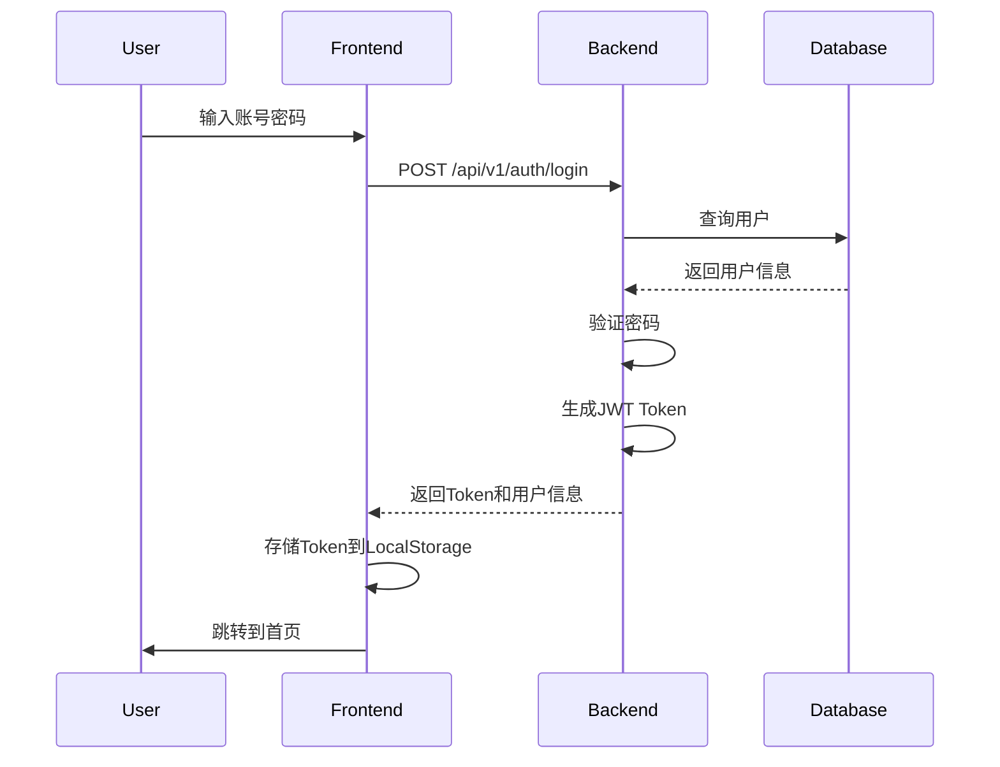
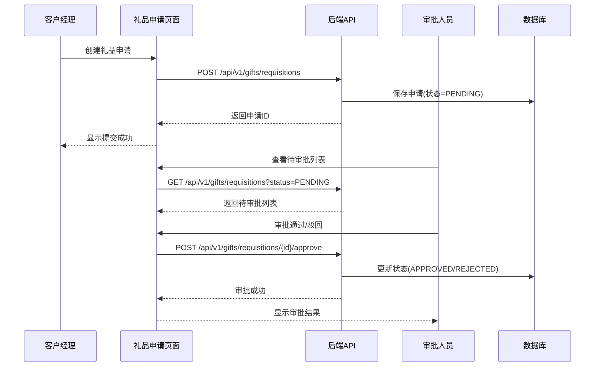

# 招财银行北京分行运营门户系统 - 技术设计文档

**文档版本**: v1.0
**创建时间**: 2026-01-08
**负责人**: 技术负责人
**项目状态**: 技术设计阶段完成,进入开发阶段

---

## 文档说明

本文档是"招财银行北京分行运营门户系统"的技术设计文档索引,提供了所有技术设计文档的导航、阅读顺序、关键要点和开发指导。开发人员应按照本文档的指引阅读相关文档并执行开发任务。

---

## 文档目录

### 核心设计文档

1. **[模块拆解文档](./module-breakdown.md)** (module-breakdown.md)
   - 前端模块拆解(10个模块)
   - 后端模块拆解(7个模块)
   - 模块依赖关系
   - 开发优先级排序

2. **[API契约规范](./api-contracts/openapi.yaml)** (api-contracts/openapi.yaml)
   - OpenAPI 3.0.3规范
   - 完整的API接口定义
   - 请求/响应数据结构
   - 认证授权规范

3. **[API开发指南](./api-contracts/api-guidelines.md)** (api-contracts/api-guidelines.md)
   - API命名规范
   - 错误处理机制
   - 分页/排序/筛选规范
   - 认证授权实现指南

4. **[数据模型设计](./data-models.md)** (data-models.md)
   - 数据库表结构设计
   - 字段定义和约束
   - 索引设计
   - 数据字典

### 实施指南文档

5. **[前端项目搭建指南](./frontend-setup-guide.md)** (frontend-setup-guide.md)
   - 项目初始化步骤
   - 目录结构设计
   - 配置文件说明
   - 开发工具配置
   - 核心代码模板

6. **[后端项目搭建指南](./backend-setup-guide.md)** (backend-setup-guide.md)
   - 项目初始化步骤
   - 目录结构设计
   - 配置文件说明
   - 数据库连接配置
   - JWT认证配置
   - Alembic迁移配置

### 计划与测试文档

7. **[开发计划](./development-plan.md)** (development-plan.md)
   - 3个开发阶段划分(P0/P1/P2)
   - 前后端并行开发策略
   - 任务优先级排序
   - 时间节点和里程碑
   - 风险与应对措施

8. **[测试策略](./testing-strategy.md)** (testing-strategy.md)
   - 测试金字塔(单元/集成/E2E)
   - 测试工具选择
   - 覆盖率要求
   - CI/CD集成
   - 性能测试策略
   - 安全测试清单

---

## 文档阅读顺序

### 场景1: 新成员加入团队

**推荐阅读顺序**:

1. **快速了解系统** (30分钟)
   - 本文档(README.md)
   - [模块拆解文档](./module-breakdown.md) - 了解系统模块划分
   - [数据模型设计](./data-models.md) - 了解数据结构

2. **深入技术细节** (1小时)
   - [API契约规范](./api-contracts/openapi.yaml) - 了解API接口
   - [API开发指南](./api-contracts/api-guidelines.md) - 了解开发规范
   - [测试策略](./testing-strategy.md) - 了解质量要求

3. **开始开发准备** (30分钟)
   - [前端项目搭建指南](./frontend-setup-guide.md) 或 [后端项目搭建指南](./backend-setup-guide.md)
   - [开发计划](./development-plan.md) - 了解任务安排

**总时间**: 约2小时

---

### 场景2: 前端开发人员

**推荐阅读顺序**:

1. **必读文档** (1小时)
   - 本文档(README.md)
   - [模块拆解文档](./module-breakdown.md) - 前端模块部分
   - [API契约规范](./api-contracts/openapi.yaml) - 了解API接口
   - [API开发指南](./api-contracts/api-guidelines.md) - 了解调用规范

2. **实施指南** (30分钟)
   - [前端项目搭建指南](./frontend-setup-guide.md)
   - [测试策略](./testing-strategy.md) - 前端测试部分

3. **开发参考** (按需查阅)
   - [开发计划](./development-plan.md) - Week-by-week任务
   - [数据模型设计](./data-models.md) - 了解数据结构

**总时间**: 约1.5小时

---

### 场景3: 后端开发人员

**推荐阅读顺序**:

1. **必读文档** (1小时)
   - 本文档(README.md)
   - [模块拆解文档](./module-breakdown.md) - 后端模块部分
   - [API契约规范](./api-contracts/openapi.yaml) - API实现要求
   - [API开发指南](./api-contracts/api-guidelines.md) - 开发规范详解

2. **实施指南** (30分钟)
   - [后端项目搭建指南](./backend-setup-guide.md)
   - [数据模型设计](./data-models.md) - 数据库表结构
   - [测试策略](./testing-strategy.md) - 后端测试部分

3. **开发参考** (按需查阅)
   - [开发计划](./development-plan.md) - Week-by-week任务

**总时间**: 约1.5小时

---

### 场景4: 技术负责人/架构师

**推荐阅读顺序**:

1. **全局了解** (30分钟)
   - 所有文档概览

2. **重点关注** (1小时)
   - [模块拆解文档](./module-breakdown.md) - 架构设计
   - [API契约规范](./api-contracts/openapi.yaml) - 接口设计
   - [数据模型设计](./data-models.md) - 数据设计
   - [开发计划](./development-plan.md) - 实施计划

3. **质量保证** (30分钟)
   - [API开发指南](./api-contracts/api-guidelines.md)
   - [测试策略](./testing-strategy.md)

**总时间**: 约2小时

---

### 场景5: 测试工程师

**推荐阅读顺序**:

1. **必读文档** (1小时)
   - 本文档(README.md)
   - [模块拆解文档](./module-breakdown.md) - 了解系统功能
   - [API契约规范](./api-contracts/openapi.yaml) - API接口定义
   - [数据模型设计](./data-models.md) - 数据结构

2. **测试指导** (1小时)
   - [测试策略](./testing-strategy.md) - 完整测试策略
   - [API开发指南](./api-contracts/api-guidelines.md) - API测试规范

**总时间**: 约2小时

---

## 核心技术要点

### 技术栈总结

#### 前端技术栈

| 技术 | 版本 | 用途 |
| --- | --- | --- |
| React | 18.2.0 | UI框架 |
| TypeScript | 5.3.2 | 类型系统 |
| Vite | 5.0.7 | 构建工具 |
| Ant Design | 5.11.5 | UI组件库 |
| ProComponents | 2.6.43 | 高级组件 |
| Zustand | 4.4.7 | 状态管理 |
| React Router | 6.20.0 | 路由管理 |
| Axios | 1.6.2 | HTTP客户端 |
| ECharts | 5.4.3 | 数据可视化 |
| ahooks | 3.7.8 | React Hooks库 |
| dayjs | 1.11.10 | 日期处理 |

#### 后端技术栈

| 技术 | 版本 | 用途 |
| --- | --- | --- |
| Python | 3.10+ | 编程语言 |
| FastAPI | 0.110.0 | Web框架 |
| Uvicorn | 0.25.0 | ASGI服务器 |
| SQLAlchemy | 2.0.23 | ORM框架 |
| PyMySQL | 1.1.0 | MySQL驱动 |
| Pydantic | 2.5.0 | 数据验证 |
| Alembic | 1.13.0 | 数据库迁移 |
| python-jose | 3.3.0 | JWT处理 |
| passlib | 1.7.4 | 密码哈希 |
| httpx | 0.25.2 | HTTP客户端 |

#### 数据库

- **MySQL 8.0+**
- 字符集: utf8mb4
- 引擎: InnoDB
- 连接池: 5-20个连接

---

### 系统架构

```
┌─────────────────────────────────────────────────────────┐
│                       用户层                             │
│  (客户经理 / 运营人员 / 审批人员 / 管理者)              │
└─────────────────────────────────────────────────────────┘
                           │
                           ▼
┌─────────────────────────────────────────────────────────┐
│                     前端 (React)                         │
│  ┌──────────┐ ┌──────────┐ ┌──────────┐ ┌──────────┐  │
│  │ 登录模块 │ │ 拜访管理 │ │ 礼品管理 │ │ 数据大屏 │  │
│  └──────────┘ └──────────┘ └──────────┘ └──────────┘  │
└─────────────────────────────────────────────────────────┘
                           │
                           │ HTTP/HTTPS (JWT)
                           │
                           ▼
┌─────────────────────────────────────────────────────────┐
│                   后端 (FastAPI)                         │
│  ┌──────────┐ ┌──────────┐ ┌──────────┐ ┌──────────┐  │
│  │ 认证模块 │ │ 业务模块 │ │ 内容模块 │ │ AI模块   │  │
│  └──────────┘ └──────────┘ └──────────┘ └──────────┘  │
└─────────────────────────────────────────────────────────┘
                           │
                           ▼
┌─────────────────────────────────────────────────────────┐
│              数据层 (MySQL 8.0)                          │
│  users | visits | gifts | carousels | news              │
└─────────────────────────────────────────────────────────┘
```

---

### 核心业务流程

#### 1. 用户认证流程



#### 2. 礼品申请审批流程



---

### 权限模型

#### 角色定义

| 角色 | 代码 | 权限范围 |
| --- | --- | --- |
| 客户经理 | CUSTOMER_MANAGER | 拜访记录管理、礼品申请、查看个人数据 |
| 运营人员 | OPERATIONS | 首页内容管理、查看运营数据 |
| 审批人员 | APPROVER | 礼品审批、查看礼品台账 |
| 管理者 | MANAGER | 数据大屏、所有数据查看权限 |

#### 数据级权限

- **拜访记录**: 只能查看自己创建的记录
- **礼品申请**: 申请人只能查看自己的申请,审批人员可查看待审批申请
- **礼品台账**: 仅审批人员和管理者可查看

---

## 开发快速开始

### 前端开发环境搭建

```bash
# 1. 创建项目
npm create vite@latest frontend -- --template react-ts
cd frontend

# 2. 安装依赖
npm install

# 3. 安装核心依赖
npm install antd @ant-design/icons @ant-design/pro-components
npm install zustand react-router-dom axios
npm install echarts echarts-for-react
npm install dayjs ahooks

# 4. 启动开发服务器
npm run dev

# 5. 访问
# http://localhost:5173
```

详细步骤请参考: [前端项目搭建指南](./frontend-setup-guide.md)

---

### 后端开发环境搭建

```bash
# 1. 创建项目目录
mkdir backend
cd backend

# 2. 创建虚拟环境
python -m venv venv
source venv/bin/activate  # Linux/Mac
# venv\Scripts\activate   # Windows

# 3. 安装依赖
pip install fastapi uvicorn sqlalchemy pymysql
pip install pydantic pydantic-settings
pip install python-jose passlib[bcrypt]
pip install alembic python-multipart
pip install python-dotenv httpx

# 4. 启动开发服务器
uvicorn main:app --reload --host 0.0.0.0 --port 8000

# 5. 访问API文档
# http://localhost:8000/docs
```

详细步骤请参考: [后端项目搭建指南](./backend-setup-guide.md)

---

### 数据库初始化

```bash
# 1. 启动MySQL (使用Docker)
docker-compose up -d

# 2. 创建数据库
mysql -u root -p
CREATE DATABASE zero_one CHARACTER SET utf8mb4 COLLATE utf8mb4_unicode_ci;

# 3. 初始化Alembic
alembic init alembic

# 4. 生成迁移脚本
alembic revision --autogenerate -m "初始化数据库表"

# 5. 执行迁移
alembic upgrade head

# 6. 插入初始数据 (手动或脚本)
# 参见 data-models.md 中的测试数据部分
```

---

## 开发任务清单

### Phase 1: 核心基础功能 (P0) - 第1-3周

#### Week 1: 项目初始化 + 认证模块

**前端任务**:
- [ ] Day 1-2: 项目初始化,搭建开发环境
  - 创建Vite + React + TypeScript项目
  - 安装依赖(antd, zustand, react-router等)
  - 配置ESLint、Prettier
- [ ] Day 3-4: 登录页开发
  - 登录表单组件
  - API调用封装
  - JWT Token存储
- [ ] Day 5: 路由守卫和权限控制
  - 路由配置
  - 路由守卫实现
  - 权限控制Hook

**后端任务**:
- [ ] Day 1-2: 项目初始化,数据库搭建
  - 创建FastAPI项目
  - 配置数据库连接
  - 创建数据库表(使用Alembic)
  - 插入初始测试数据
- [ ] Day 3-4: 认证模块开发
  - 用户登录API
  - JWT Token生成和验证
  - 权限控制中间件
- [ ] Day 5: API测试和文档完善
  - 单元测试编写
  - API文档完善(Swagger)

**验收标准**:
- 用户可使用账号密码登录
- 前后端可正常对接
- API文档可访问

---

#### Week 2: 拜访管理模块

**前端任务**:
- [ ] Day 1-2: 拜访记录列表页
  - 列表组件
  - 分页组件
  - 筛选组件
- [ ] Day 3-4: 拜访记录新增/编辑页
  - 表单组件
  - 表单验证
  - 提交处理
- [ ] Day 5: 前后端联调

**后端任务**:
- [ ] Day 1-2: 拜访记录CRUD API
  - 创建拜访记录API
  - 查询列表API(分页、排序、筛选)
  - 更新、删除API
- [ ] Day 3-4: 权限控制和数据校验
  - 数据级权限(仅看自己的)
  - 数据验证
  - 错误处理
- [ ] Day 5: 单元测试和集成测试

**验收标准**:
- 客户经理可创建、编辑、查看拜访记录
- 只能查看自己创建的记录
- 分页、排序、筛选功能正常

---

#### Week 3: 礼品管理模块

**前端任务**:
- [ ] Day 1-2: 礼品申请页面
  - 申请表单
  - 礼品选择组件
  - 申请列表
- [ ] Day 3-4: 礼品审批页面
  - 待审批列表
  - 审批详情
  - 审批操作(通过/驳回)
- [ ] Day 5: 前后端联调

**后端任务**:
- [ ] Day 1-2: 礼品申请API
  - 创建申请API
  - 查询申请列表API
  - 申请详情API
- [ ] Day 3-4: 礼品审批API
  - 审批API(通过/驳回)
  - 审批历史记录
  - 状态流转控制
- [ ] Day 5: 单元测试和集成测试

**验收标准**:
- 客户经理可提交礼品申请
- 审批人员可审批礼品申请
- 审批流程状态流转正确
- 驳回原因必填

---

### Phase 2: 扩展功能 (P1) - 第4-5周

#### Week 4: 内容管理模块

**前端任务**:
- [ ] 首页模块
  - 轮播图组件
  - 新闻列表组件
  - 快捷入口组件
- [ ] 内容管理模块
  - 轮播图管理页
  - 新闻管理页
  - 富文本编辑器
  - 图片上传组件

**后端任务**:
- [ ] 内容管理API
  - 轮播图CRUD API
  - 新闻CRUD API
  - 图片上传API
  - 权限控制(仅运营人员)

**验收标准**:
- 首页可展示轮播图和新闻
- 运营人员可维护首页内容
- 图片上传功能正常

---

#### Week 5: 数据大屏 + 个人中心

**前端任务**:
- [ ] 数据大屏模块
  - 指标卡片组件
  - 折线图组件
  - 条形图组件
  - 饼图组件
  - 时间维度切换
- [ ] 个人中心模块
  - 个人信息页
  - 密码修改页

**后端任务**:
- [ ] 数据大屏API
  - 运营指标统计API
  - 拜访趋势API
  - 礼品支出API
  - 礼品分类占比API
- [ ] 个人中心API
  - 获取用户信息API
  - 更新用户信息API
  - 修改密码API

**验收标准**:
- 管理者可查看运营数据大屏
- 图表数据准确
- 支持时间维度切换
- 用户可修改个人信息和密码

---

### Phase 3: 增值功能 (P2) - 第6周

#### Week 6: AI助理模块

**前端任务**:
- [ ] AI助理模块
  - 聊天面板组件
  - 消息列表组件
  - 消息输入框
  - 浮动按钮
  - 侧边栏展开/收起

**后端任务**:
- [ ] AI助理API
  - AI对话API
  - 外部LLM API调用
  - 对话历史管理(可选)
  - 超时和重试机制

**验收标准**:
- AI助理可回答系统使用问题
- 支持多轮对话
- 响应及时(3秒内)

---

## 质量标准

### 代码质量

#### 前端代码规范

- **ESLint**: 无警告
- **Prettier**: 代码格式统一
- **TypeScript**: 严格模式,无any类型
- **组件命名**: PascalCase
- **文件命名**: kebab-case
- **注释**: 复杂逻辑必须添加注释

#### 后端代码规范

- **Black**: 代码格式化
- **isort**: 导入排序
- **Flake8**: 代码检查
- **mypy**: 类型检查
- **PEP 8**: Python代码规范
- **Docstring**: 所有函数必须有文档字符串

---

### 测试覆盖率

| 阶段 | 单元测试 | 集成测试 | E2E测试 |
| --- | --- | --- | --- |
| Phase 1 | ≥ 60% | API全覆盖 | 关键流程 |
| Phase 2 | ≥ 70% | API全覆盖 | 关键流程 |
| Phase 3 | ≥ 80% | API全覆盖 | 关键流程 |

---

### 性能指标

| API端点 | 目标响应时间 (P95) |
| --- | --- |
| POST /api/v1/auth/login | < 500ms |
| GET /api/v1/visits | < 300ms |
| POST /api/v1/visits | < 500ms |
| GET /api/v1/dashboard/* | < 1000ms |
| POST /api/v1/ai/chat | < 3000ms |

---

## 常见问题

### Q1: 前端如何调用后端API?

**A**: 使用Axios实例,已在 `src/services/api.ts` 中配置好拦截器。

```typescript
import api from '@/services/api';

// 调用API
const response = await api.get('/api/v1/visits');
const data = response.data;
```

详见: [前端项目搭建指南](./frontend-setup-guide.md) 第7.1节

---

### Q2: 如何实现权限控制?

**A**: 后端使用依赖注入 `require_role()`,前端使用路由守卫 `ProtectedRoute`。

后端示例:
```python
from api.deps import require_role

@app.get("/api/v1/admin/users")
def get_users(current_user: User = Depends(require_role(["MANAGER"]))):
    pass
```

前端示例:
```typescript
<Route path="/admin" element={
  <ProtectedRoute roles={["MANAGER"]}>
    <AdminPage />
  </ProtectedRoute>
} />
```

详见: [API开发指南](./api-contracts/api-guidelines.md) 第4节

---

### Q3: 如何处理文件上传?

**A**: 前端使用FormData,后端使用UploadFile。

前端:
```typescript
const formData = new FormData();
formData.append('file', file);
await api.post('/api/v1/upload', formData);
```

后端:
```python
@app.post("/api/v1/upload")
async def upload(file: UploadFile = File(...)):
    contents = await file.read()
    # 保存文件
```

---

### Q4: 如何运行测试?

**A**:

前端测试:
```bash
# 单元测试
npm run test:unit

# E2E测试
npm run test:e2e

# 覆盖率
npm run test:coverage
```

后端测试:
```bash
# 所有测试
pytest

# 覆盖率
pytest --cov=. --cov-report=html
```

详见: [测试策略](./testing-strategy.md)

---

### Q5: 如何进行数据库迁移?

**A**: 使用Alembic。

```bash
# 生成迁移脚本
alembic revision --autogenerate -m "描述"

# 执行迁移
alembic upgrade head

# 回滚迁移
alembic downgrade -1
```

详见: [后端项目搭建指南](./backend-setup-guide.md) 第7节

---

## 相关资源

### 内部文档

- **需求文档**: `/agent-workspace/01-requirements/`
- **UX设计**: `/agent-workspace/02-ux/`
- **架构设计**: `/agent-workspace/03-architecture/`
- **环境配置**: `/agent-workspace/06-environment-config/`

### 外部资源

- **React官方文档**: https://react.dev/
- **Ant Design文档**: https://ant.design/
- **FastAPI官方文档**: https://fastapi.tiangolo.com/
- **SQLAlchemy文档**: https://docs.sqlalchemy.org/
- **MySQL文档**: https://dev.mysql.com/doc/

---

## 变更记录

| 版本 | 日期 | 变更内容 | 负责人 |
| --- | --- | --- | --- |
| v1.0 | 2026-01-08 | 初始版本,完成所有技术设计文档 | 技术负责人 |

---

## 联系方式

如有技术问题,请联系:

- **技术负责人**: [邮箱]
- **架构师**: [邮箱]
- **前端负责人**: [邮箱]
- **后端负责人**: [邮箱]

---

**下一步行动**:

1. 所有开发人员阅读本文档和相关技术文档
2. 按照项目搭建指南初始化开发环境
3. 参考开发计划开始Week 1任务
4. 每日站会同步进度和问题
5. 每周评审演示已完成功能

**预祝开发顺利!**
