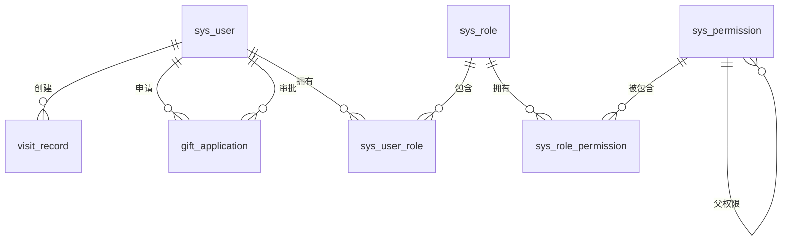

# 数据模型

## 1. 概述

本文档定义了分行客户管理系统的数据模型，包括数据库表结构、字段类型、约束条件和关系。系统采用MySQL数据库存储结构化数据，Redis缓存热点数据。

## 2. 数据库设计原则

- **规范化设计**：遵循数据库规范化原则，减少数据冗余
- **高性能**：合理设计索引，优化查询性能
- **可扩展性**：设计灵活的数据模型，支持未来功能扩展
- **数据完整性**：通过约束条件确保数据的完整性和一致性
- **安全性**：敏感数据加密存储，权限控制严格

## 3. 核心数据模型

### 3.1 用户信息表（sys_user）

| 字段名 | 数据类型 | 约束 | 描述 |
|--------|----------|------|------|
| id | BIGINT | PRIMARY KEY, AUTO_INCREMENT | 用户ID |
| username | VARCHAR(50) | UNIQUE, NOT NULL | 用户名 |
| password | VARCHAR(255) | NOT NULL | 密码（加密存储） |
| real_name | VARCHAR(50) | NOT NULL | 真实姓名 |
| role | VARCHAR(20) | NOT NULL | 用户角色（admin, manager, staff） |
| department | VARCHAR(100) | NOT NULL | 所属部门 |
| email | VARCHAR(100) | UNIQUE | 邮箱 |
| phone | VARCHAR(20) | UNIQUE | 手机号 |
| status | TINYINT | NOT NULL DEFAULT 1 | 状态（0：禁用，1：启用） |
| create_time | DATETIME | NOT NULL DEFAULT CURRENT_TIMESTAMP | 创建时间 |
| update_time | DATETIME | NOT NULL DEFAULT CURRENT_TIMESTAMP ON UPDATE CURRENT_TIMESTAMP | 更新时间 |

### 3.2 客户拜访记录表（visit_record）

| 字段名 | 数据类型 | 约束 | 描述 |
|--------|----------|------|------|
| id | BIGINT | PRIMARY KEY, AUTO_INCREMENT | 拜访记录ID |
| customer_name | VARCHAR(100) | NOT NULL | 客户名称 |
| customer_contact | VARCHAR(50) | | 客户联系方式 |
| visit_date | DATETIME | NOT NULL | 拜访日期时间 |
| visit_content | TEXT | NOT NULL | 拜访内容 |
| next_visit_plan | TEXT | | 下次拜访计划 |
| created_by | BIGINT | NOT NULL, FOREIGN KEY REFERENCES sys_user(id) | 创建人ID |
| created_time | DATETIME | NOT NULL DEFAULT CURRENT_TIMESTAMP | 创建时间 |
| updated_by | BIGINT | FOREIGN KEY REFERENCES sys_user(id) | 更新人ID |
| updated_time | DATETIME | NOT NULL DEFAULT CURRENT_TIMESTAMP ON UPDATE CURRENT_TIMESTAMP | 更新时间 |

**索引**：
- 联合索引：(customer_name, visit_date) - 用于按客户名称和拜访日期查询
- 索引：(created_by, visit_date) - 用于按创建人和拜访日期查询

### 3.3 礼品申请表（gift_application）

| 字段名 | 数据类型 | 约束 | 描述 |
|--------|----------|------|------|
| id | BIGINT | PRIMARY KEY, AUTO_INCREMENT | 礼品申请ID |
| customer_name | VARCHAR(100) | NOT NULL | 客户名称 |
| gift_name | VARCHAR(100) | NOT NULL | 礼品名称 |
| quantity | INT | NOT NULL | 礼品数量 |
| reason | TEXT | NOT NULL | 申请理由 |
| status | VARCHAR(20) | NOT NULL DEFAULT 'pending' | 申请状态（pending：待审批，approved：已通过，rejected：已拒绝） |
| applicant_id | BIGINT | NOT NULL, FOREIGN KEY REFERENCES sys_user(id) | 申请人ID |
| approve_id | BIGINT | FOREIGN KEY REFERENCES sys_user(id) | 审批人ID |
| approve_comment | TEXT | | 审批意见 |
| approve_time | DATETIME | | 审批时间 |
| created_time | DATETIME | NOT NULL DEFAULT CURRENT_TIMESTAMP | 创建时间 |
| updated_time | DATETIME | NOT NULL DEFAULT CURRENT_TIMESTAMP ON UPDATE CURRENT_TIMESTAMP | 更新时间 |

**索引**：
- 索引：(status, created_time) - 用于按状态和创建时间查询
- 索引：(applicant_id, created_time) - 用于按申请人和创建时间查询

### 3.4 轮播图配置表（banner）

| 字段名 | 数据类型 | 约束 | 描述 |
|--------|----------|------|------|
| id | BIGINT | PRIMARY KEY, AUTO_INCREMENT | 轮播图ID |
| title | VARCHAR(100) | NOT NULL | 轮播图标题 |
| image_url | VARCHAR(255) | NOT NULL | 图片URL |
| link_url | VARCHAR(255) | | 链接URL |
| order_num | INT | NOT NULL DEFAULT 0 | 排序号 |
| is_active | TINYINT | NOT NULL DEFAULT 1 | 是否激活（0：禁用，1：启用） |
| create_time | DATETIME | NOT NULL DEFAULT CURRENT_TIMESTAMP | 创建时间 |
| update_time | DATETIME | NOT NULL DEFAULT CURRENT_TIMESTAMP ON UPDATE CURRENT_TIMESTAMP | 更新时间 |

**索引**：
- 索引：(is_active, order_num) - 用于按激活状态和排序号查询

### 3.5 新闻表（news）

| 字段名 | 数据类型 | 约束 | 描述 |
|--------|----------|------|------|
| id | BIGINT | PRIMARY KEY, AUTO_INCREMENT | 新闻ID |
| title | VARCHAR(200) | NOT NULL | 新闻标题 |
| content | LONGTEXT | NOT NULL | 新闻内容 |
| author | VARCHAR(50) | NOT NULL | 作者 |
| publish_time | DATETIME | NOT NULL DEFAULT CURRENT_TIMESTAMP | 发布时间 |
| is_published | TINYINT | NOT NULL DEFAULT 1 | 是否发布（0：草稿，1：已发布） |
| view_count | INT | NOT NULL DEFAULT 0 | 浏览次数 |
| create_time | DATETIME | NOT NULL DEFAULT CURRENT_TIMESTAMP | 创建时间 |
| update_time | DATETIME | NOT NULL DEFAULT CURRENT_TIMESTAMP ON UPDATE CURRENT_TIMESTAMP | 更新时间 |

**索引**：
- 索引：(is_published, publish_time) - 用于按发布状态和发布时间查询
- 全文索引：(title, content) - 用于新闻搜索

### 3.6 角色表（sys_role）

| 字段名 | 数据类型 | 约束 | 描述 |
|--------|----------|------|------|
| id | BIGINT | PRIMARY KEY, AUTO_INCREMENT | 角色ID |
| role_name | VARCHAR(50) | UNIQUE, NOT NULL | 角色名称 |
| role_code | VARCHAR(20) | UNIQUE, NOT NULL | 角色编码 |
| description | VARCHAR(255) | | 角色描述 |
| create_time | DATETIME | NOT NULL DEFAULT CURRENT_TIMESTAMP | 创建时间 |
| update_time | DATETIME | NOT NULL DEFAULT CURRENT_TIMESTAMP ON UPDATE CURRENT_TIMESTAMP | 更新时间 |

### 3.7 权限表（sys_permission）

| 字段名 | 数据类型 | 约束 | 描述 |
|--------|----------|------|------|
| id | BIGINT | PRIMARY KEY, AUTO_INCREMENT | 权限ID |
| permission_name | VARCHAR(50) | UNIQUE, NOT NULL | 权限名称 |
| permission_code | VARCHAR(50) | UNIQUE, NOT NULL | 权限编码 |
| resource_type | VARCHAR(20) | NOT NULL | 资源类型（menu, button, api） |
| resource_path | VARCHAR(255) | NOT NULL | 资源路径 |
| parent_id | BIGINT | FOREIGN KEY REFERENCES sys_permission(id) | 父权限ID |
| create_time | DATETIME | NOT NULL DEFAULT CURRENT_TIMESTAMP | 创建时间 |
| update_time | DATETIME | NOT NULL DEFAULT CURRENT_TIMESTAMP ON UPDATE CURRENT_TIMESTAMP | 更新时间 |

### 3.8 用户角色关联表（sys_user_role）

| 字段名 | 数据类型 | 约束 | 描述 |
|--------|----------|------|------|
| user_id | BIGINT | PRIMARY KEY, FOREIGN KEY REFERENCES sys_user(id) | 用户ID |
| role_id | BIGINT | PRIMARY KEY, FOREIGN KEY REFERENCES sys_role(id) | 角色ID |

### 3.9 角色权限关联表（sys_role_permission）

| 字段名 | 数据类型 | 约束 | 描述 |
|--------|----------|------|------|
| role_id | BIGINT | PRIMARY KEY, FOREIGN KEY REFERENCES sys_role(id) | 角色ID |
| permission_id | BIGINT | PRIMARY KEY, FOREIGN KEY REFERENCES sys_permission(id) | 权限ID |

### 3.10 系统配置表（sys_config）

| 字段名 | 数据类型 | 约束 | 描述 |
|--------|----------|------|------|
| id | BIGINT | PRIMARY KEY, AUTO_INCREMENT | 配置ID |
| config_key | VARCHAR(100) | UNIQUE, NOT NULL | 配置键 |
| config_value | TEXT | NOT NULL | 配置值 |
| description | VARCHAR(255) | | 配置描述 |
| create_time | DATETIME | NOT NULL DEFAULT CURRENT_TIMESTAMP | 创建时间 |
| update_time | DATETIME | NOT NULL DEFAULT CURRENT_TIMESTAMP ON UPDATE CURRENT_TIMESTAMP | 更新时间 |

## 4. 数据关系图

## 5. Redis缓存设计

### 5.1 缓存类型

- **热点数据缓存**：存储频繁访问的数据，如首页轮播图、新闻列表等
- **会话缓存**：存储用户会话信息
- **计数器缓存**：存储统计数据，如新闻浏览次数等
- **临时数据缓存**：存储临时生成的数据，如验证码、Token等

### 5.2 缓存键命名规范

| 缓存类型 | 键名格式 | 示例 | 过期时间 |
|----------|----------|------|----------|
| 轮播图 | banner:active | banner:active | 1小时 |
| 新闻列表 | news:list:{page}:{size} | news:list:1:10 | 30分钟 |
| 新闻详情 | news:detail:{id} | news:detail:1 | 1小时 |
| 用户会话 | session:{token} | session:abc123 | 30分钟 |
| 统计数据 | stats:visit:{timeDimension}:{startDate}:{endDate} | stats:visit:month:2023-01:2023-01 | 1小时 |

### 5.3 缓存更新策略

- **主动更新**：数据变更时主动更新缓存
- **过期更新**：缓存过期后重新加载数据
- **惰性更新**：访问缓存时如果不存在则加载数据并更新缓存

## 6. 数据完整性约束

### 6.1 实体完整性

- 所有表都必须有主键
- 主键字段不允许为空
- 主键值必须唯一

### 6.2 参照完整性

- 外键必须引用父表的主键
- 外键值必须存在于父表中，或为NULL（如果允许）
- 删除或更新父表记录时，子表记录应按约定处理（CASCADE、SET NULL、RESTRICT等）

### 6.3 域完整性

- 字段值必须符合数据类型要求
- 字段值必须在指定的范围内
- 字段值必须符合格式要求（如邮箱、手机号等）

### 6.4 业务完整性

- 礼品申请数量必须大于0
- 拜访日期必须是有效日期
- 审批人ID不能与申请人ID相同

## 7. 数据安全设计

### 7.1 敏感数据保护

- **密码**：使用BCrypt等强哈希算法加密存储
- **个人信息**：如手机号、邮箱等，脱敏处理后显示
- **敏感配置**：如API密钥、数据库连接字符串等，加密存储

### 7.2 数据访问控制

- 基于角色的访问控制（RBAC）
- 细粒度的数据权限控制
- 审计日志记录所有数据操作

### 7.3 数据备份与恢复

- 定期全量备份数据库
- 实时增量备份
- 测试恢复流程，确保数据可恢复性

## 8. 数据迁移策略

### 8.1 初始数据迁移

- 使用SQL脚本导入初始数据
- 包括系统配置、角色权限、初始用户等

### 8.2 增量数据迁移

- 使用数据库迁移工具（如Flyway、Liquibase）管理数据库变更
- 每次版本更新时执行对应的迁移脚本
- 迁移脚本必须包含回滚机制

### 8.3 数据同步

- 与分行内部用户体系的数据同步
- 使用定时任务或消息队列实现数据同步
- 确保数据一致性和完整性

## 9. 数据归档策略

### 9.1 归档条件

- 数据超过指定时间（如1年）
- 数据不再频繁访问
- 数据量过大影响性能

### 9.2 归档方式

- 将历史数据迁移到归档表
- 归档表与原表结构相同
- 保留查询接口，允许查询历史数据

### 9.3 归档周期

- 每年归档一次
- 归档时间选择在系统低峰期
- 归档前进行数据完整性检查

## 10. 性能优化

### 10.1 索引优化

- 为频繁查询的字段创建索引
- 避免创建过多索引，影响写入性能
- 定期分析和优化索引

### 10.2 查询优化

- 避免全表扫描
- 使用分页查询
- 优化JOIN查询
- 使用预编译语句

### 10.3 写入优化

- 使用批量插入
- 合理设置事务隔离级别
- 避免长事务

### 10.4 数据库配置优化

- 根据业务需求调整数据库参数
- 配置适当的连接池大小
- 启用查询缓存（如果适用）

## 11. 数据模型变更管理

### 11.1 变更流程

1. 分析数据模型变更需求
2. 设计变更方案
3. 编写迁移脚本
4. 测试变更方案
5. 执行变更
6. 验证变更结果

### 11.2 变更原则

- 保持向后兼容
- 最小化变更影响
- 确保数据完整性
- 记录变更日志

## 12. 数据模型文档维护

- 数据模型变更后及时更新文档
- 文档与实际数据库结构保持一致
- 定期审核数据模型，优化设计
- 文档版本与系统版本对应