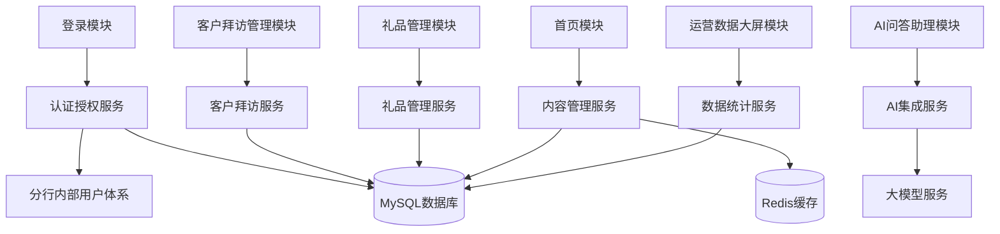

# 模块分解

## 1. 系统模块概览

系统采用分层架构设计，主要分为表现层、应用层、数据层和外部系统集成。各层之间通过明确的接口进行交互，确保低耦合高内聚的设计原则。

## 2. 模块详细分解

### 2.1 表现层模块

| 模块名称 | 功能描述 | 主要组件 | 依赖关系 |
|----------|----------|----------|----------|
| 登录模块 | 提供用户登录功能 | 登录页面、登录表单、错误提示 | 认证授权服务 |
| 首页模块 | 系统主入口，展示关键信息 | 轮播图、新闻列表、功能导航、用户信息 | 内容管理服务 |
| 客户拜访管理模块 | 管理客户拜访记录 | 拜访记录列表、新增拜访表单、编辑拜访表单、查询功能 | 客户拜访服务 |
| 礼品管理模块 | 管理礼品申请和审批 | 礼品申请表单、礼品审批列表、礼品台账、审批功能 | 礼品管理服务 |
| 运营数据大屏模块 | 可视化展示运营数据 | 数据图表、指标卡片、筛选条件 | 数据统计服务 |
| AI问答助理模块 | 提供AI咨询服务 | 问答对话框、对话历史、问题输入框 | AI集成服务 |

### 2.2 应用层模块

| 模块名称 | 功能描述 | 核心接口 | 依赖关系 |
|----------|----------|----------|----------|
| 认证授权服务 | 处理用户认证和权限控制 | 登录验证、权限检查、Session管理 | 分行内部用户体系、MySQL数据库 |
| 客户拜访服务 | 处理客户拜访相关业务逻辑 | 拜访记录CRUD、权限验证、数据校验 | MySQL数据库 |
| 礼品管理服务 | 处理礼品申请和审批业务 | 礼品申请提交、审批流程管理、状态更新 | MySQL数据库 |
| 内容管理服务 | 管理系统内容 | 轮播图管理、新闻管理、内容缓存 | MySQL数据库、Redis缓存 |
| 数据统计服务 | 处理运营数据统计分析 | 数据聚合、指标计算、图表数据生成 | MySQL数据库 |
| AI集成服务 | 与大模型服务交互 | 问题转发、回答处理、会话管理 | 大模型服务 |

### 2.3 数据层模块

| 模块名称 | 功能描述 | 主要组件 | 依赖关系 |
|----------|----------|----------|----------|
| MySQL数据库 | 存储结构化数据 | 数据表、索引、存储过程 | 无 |
| Redis缓存 | 缓存热点数据 | 缓存键值、过期策略 | 无 |

### 2.4 外部系统集成模块

| 模块名称 | 功能描述 | 交互方式 | 依赖关系 |
|----------|----------|----------|----------|
| 分行内部用户体系集成 | 验证用户身份 | API调用 | 认证授权服务 |
| 大模型服务集成 | 提供AI问答能力 | API调用 | AI集成服务 |

## 3. 模块职责边界

| 模块 | 核心职责 | 职责边界 |
|------|----------|----------|
| 认证授权服务 | 用户身份验证和权限控制 | 负责登录验证、Session管理、角色权限检查，不处理业务逻辑 |
| 客户拜访服务 | 客户拜访记录管理 | 只处理客户拜访相关的业务逻辑，不涉及其他业务领域 |
| 礼品管理服务 | 礼品申请和审批流程 | 只处理礼品相关的业务逻辑，包括申请、审批、台账管理 |
| 内容管理服务 | 系统内容管理 | 负责首页轮播图、新闻等内容的管理，包括缓存策略 |
| 数据统计服务 | 运营数据统计分析 | 负责从数据库提取原始数据，进行聚合计算，生成图表数据 |
| AI集成服务 | AI能力集成 | 负责与大模型服务的交互，处理请求和响应，不直接处理业务逻辑 |

## 4. 模块间依赖关系

## 5. 模块扩展点

| 模块 | 扩展点 | 扩展方式 |
|------|--------|----------|
| 认证授权服务 | 认证方式扩展 | 通过接口设计支持多种认证方式，如OAuth2.0、生物识别等 |
| 客户拜访服务 | 拜访类型扩展 | 设计灵活的拜访类型字段，支持未来新增拜访类型 |
| 礼品管理服务 | 审批流程扩展 | 采用可配置的审批流程设计，支持未来调整审批层级 |
| 内容管理服务 | 内容类型扩展 | 设计通用的内容模型，支持未来新增内容类型 |
| 数据统计服务 | 指标扩展 | 设计可扩展的指标计算框架，支持未来新增统计指标 |
| AI集成服务 | AI能力扩展 | 设计统一的AI接口，支持未来接入多种AI服务 |

## 6. 模块实现技术栈

| 模块 | 技术栈 |
|------|--------|
| 表现层模块 | React + Ant Design + ECharts + Redux + React Router |
| 应用层模块 | Spring Boot + Java 11 + Spring Security |
| 数据层模块 | MySQL 8.0 + Redis 6.0 |
| 外部系统集成模块 | RESTful API + HttpClient |

## 7. 模块部署策略

| 模块 | 部署方式 | 部署位置 |
|------|----------|----------|
| 表现层模块 | 静态资源部署 | 分行内部Web服务器 |
| 应用层模块 | 独立应用部署 | 分行内部应用服务器 |
| 数据层模块 | 数据库集群部署 | 分行内部数据库服务器 |
| 外部系统集成 | API调用 | 分行内部网络 |