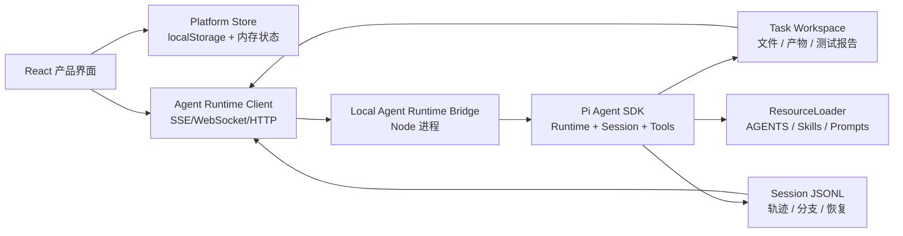

# Agent SDK 真实平台化建设方案

更新日期：2026-05-15

## 一句话结论

当前产品已经有很好的“研发任务指挥台”形态，下一步不应该重做模型、上下文、工具和会话能力，而应该把平台收敛为任务编排层：用户发布任务、确认关键决策、查看真实产物、和 Agent 自然语言协作；底层由 Pi Agent SDK 承担会话、工具、上下文、文件修改、事件流和分支恢复。

## 当前项目现状

现有应用是 Vite + React 单页原型，状态通过 `localStorage` 持久化。产品结构已经比较清晰：

- 首页任务面板：故事卡、缺陷、治理任务三类任务入口。
- 工作空间：顶部 SOP 导航，左侧任务驻留卡和 Workspace 文件树，右侧决策台。
- SOP 流程：意图校准、范围锁定、Spec 基线、Agent 开发、质量门禁、验证修复、发布交付。
- 协作体验：交付卡片、任务轨迹 Chat、侧边抽屉预览代码/文档/HTML。

主要静态点：

- `src/data/stageContent.ts` 预置了每个阶段的 summary、deliverables、trajectory。
- `src/data/taskData.ts` 预置了任务卡、模块、Spec 资产、测试数据、文件树。
- `src/data/workflowData.ts` 通过 `stepIndex` 推导 Agent 状态和质量门禁。
- `src/components/DecisionBoard.tsx` 的轨迹对话使用本地随机回复，未连接真实 agent session。
- `src/App.tsx` 的文件预览来自 `getMockFileContent()`，不是读取真实工作区产物。

这意味着 UI 已经足够承载真实工作流，短板不是界面，而是缺少“任务运行时”和“产物事实源”。

## SDK 能力理解

Pi Agent SDK 的核心抽象可以直接覆盖平台所需能力：

- `createAgentSession()`：创建单个 Agent 会话，用于某个阶段或某个角色的真实执行。
- `AgentSession.prompt()` / `steer()` / `followUp()`：平台向 Agent 发布任务、插入转向指令、追加后续要求。
- `session.subscribe()`：将 `message_update`、`tool_execution_*`、`agent_start/end`、`queue_update` 等事件实时映射到 UI。
- `createAgentSessionRuntime()`：管理新会话、恢复、切换、fork、import 等“任务运行时”行为。
- `SessionManager`：持久化 session jsonl，支持 list/open/continue/tree/branch/label，可作为任务轨迹和变更分支的事实来源。
- `DefaultResourceLoader`：加载 AGENTS.md、skills、prompt templates、extensions、context files，让平台把任务上下文注入给 Agent。
- `tools` / `customTools` / `defineTool()`：控制内置工具和平台自定义工具。内置工具包括 read、bash、edit、write、grep、find、ls。
- `SettingsManager`：控制 compaction、retry、默认 thinking level 等运行策略。
- `AuthStorage` / `ModelRegistry`：承接模型与密钥，不应该把密钥放进浏览器 storage。
- `runRpcMode()`：可以把 SDK 运行时做成独立子进程，通过 JSON-RPC 被平台调用。

需要特别注意：

- SDK 是面向 Node/终端 coding harness 的能力，不适合直接塞进浏览器 bundle。
- `prompt()` 在流式输出期间再次调用需要指定 `streamingBehavior`，否则会报错；UI 的“继续对话”需要映射为 `steer` 或 `followUp`。
- runtime 替换 session 后，订阅和 extension binding 需要重新绑定。
- built-in `bash/edit/write` 能力必须被 cwd 和工具白名单约束，否则演示环境会变得不可控。
- `AGENTS.md` 会被 ResourceLoader 当作上下文文件加载，这和当前项目根目录的工作方式一致。

## 推荐总体架构

平台分三层：



### 为什么需要 Local Agent Runtime Bridge

项目要求“无需考虑后端实现”仍然成立：业务数据、任务列表、用户交互状态继续用浏览器 storage 和 mock 数据。但 SDK 需要 Node 运行时来访问文件系统、执行工具、运行 bash、保存 session，所以需要一个本地 sidecar/bridge，不是生产后端。

MVP 可以直接在 Node bridge 中 import SDK；后续如果要隔离 Agent 进程，可以切到 SDK 的 `runRpcMode()`，保持前端的 `AgentRuntimeClient` 接口不变。

## 关键领域模型

建议把当前 `AppState` 拆成更可组合的领域对象，避免继续用 `stepIndex` 推导一切。

```ts
type PlatformTask = {
  id: string;
  source: "card" | "freeform";
  title: string;
  intent: string;
  status: "draft" | "running" | "blocked" | "ready_for_review" | "done";
  currentStage: WorkflowId;
  createdAt: string;
};

type ChangeSet = {
  id: string;
  taskId: string;
  workspacePath: string;
  sessionFile?: string;
  baseBranchLabel?: string;
  status: "planning" | "building" | "testing" | "fixing" | "released";
};

type StageRun = {
  id: string;
  taskId: string;
  stage: WorkflowId;
  role: "product" | "architect" | "frontend" | "test" | "devops";
  sessionId: string;
  status: "queued" | "streaming" | "waiting_user" | "done" | "failed";
  startedAt: string;
  endedAt?: string;
};

type Artifact = {
  id: string;
  taskId: string;
  stage: WorkflowId;
  kind: "summary" | "spec" | "code" | "test_report" | "diff" | "preview" | "release_note";
  title: string;
  path?: string;
  content?: string;
  status: "draft" | "ready" | "superseded";
};

type Decision = {
  id: string;
  taskId: string;
  stage: WorkflowId;
  label: string;
  options?: string[];
  selected?: string;
  status: "open" | "confirmed";
};
```

UI 仍可以保持当前 taste，但数据来源从 `getContentForStage(stepIndex)` 转为：

- `StageRun.events` 渲染任务轨迹。
- `Artifact[]` 渲染交付卡片和抽屉预览。
- `Decision[]` 渲染当前阶段的确认按钮、选择卡、质量放行。
- `WorkspaceIndex` 渲染左侧真实文件树。

## SOP 到真实能力的映射

### 1. 意图校准

触发：用户从任务卡或一句话需求创建任务。

真实执行：

- 创建任务工作区和 Agent session。
- 注入任务卡、用户 notes、AGENTS.md、当前平台约束。
- 使用 Product Agent prompt 生成结构化 JSON：目标、角色、业务对象、边界、风险、推荐交付模式、需要用户确认的问题。
- UI 把 JSON 渲染为 summary、deliverables、decision cards。

工具建议：

- 只开放 read/grep/ls 和平台自定义工具 `platform_write_artifact`。
- 不开放 edit/write/bash，避免意图阶段产生不必要的文件变更。

### 2. 范围锁定

触发：用户选择 MVP/受控/完整交付模式，并勾选模块。

真实执行：

- Architect Agent 基于意图结果生成模块依赖图、风险边界、迭代建议。
- 把用户选择写入 `spec/scope.json` 或平台 artifact。
- 未选模块进入 backlog artifact，而不是消失。

UI 替换点：

- 当前固定 `moduleOptions` 可以保留为初始建议，但后续由 Agent 产出的模块列表驱动。

### 3. Spec 基线

触发：用户确认范围。

真实执行：

- Architect Agent 在任务工作区生成机器可读资产：
  - `spec/product.md`
  - `spec/acceptance.yaml`
  - `spec/domain-model.json`
  - `spec/ui-map.json`
  - `spec/openapi.yaml`
  - `spec/permissions.md`
- 平台记录一次 baseline label，后续构建和修复都可以回滚到这个点。

工具建议：

- 开放 read/write/edit/grep/ls。
- 可用自定义工具 `platform_record_decision` 固化用户确认。

### 4. Agent 开发

触发：用户确认 Spec 基线。

真实执行：

- Frontend Agent 读取 Spec，生成可运行前端页面、组件、mock 数据和样式。
- Test Agent 同步把 acceptance 转成测试用例。
- Architect Agent 维护契约一致性。
- 所有产物写入隔离任务工作区，例如 `.zero-one/tasks/{taskId}/workspace`，不要直接改平台自身代码。

并行策略：

- MVP 阶段优先“角色分工 + 顺序提交”：一个阶段一个主 session，减少文件冲突。
- 需要并行时，让不同角色写入不同目录或不同 artifact，最后由 Integrator prompt 合并。
- UI 可以展示多 Agent 并行，但状态必须来自真实 `StageRun` 和工具事件。

### 5. 质量门禁

触发：开发阶段完成。

真实执行：

- Test Agent 或 DevOps Agent 运行真实命令：类型检查、单测、构建、轻量 E2E。
- 质量报告来自 bash/tool 输出，不再写死 12/12、87%、8/10。
- 失败项生成结构化 `QualityGate` 和 `test-report.md/html` artifact。

工具建议：

- 开放 read/bash/grep/ls。
- `bash` 命令需要白名单策略，例如只允许 npm scripts、测试命令、构建命令和只读诊断命令。

### 6. 验证修复

触发：质量门禁失败或用户提出修改。

真实执行：

- 使用 `SessionManager` tree/fork 能力从失败节点创建修复分支。
- Agent 生成修复 plan 和 diff preview，用户授权后再写入工作区。
- 修复后自动复测，把复测结果绑定到同一个 ChangeSet。

UI 替换点：

- 当前“授权 Agent 自动修复”按钮应触发真实 `followUp()` 或新的 stage run。
- 侧栏 diff 来自工作区 git diff 或 SDK 编辑事件汇总。

### 7. 发布交付

触发：质量和复测通过。

真实执行：

- 生成交付包：源码、Spec、测试报告、变更摘要、风险说明、回滚点。
- 本阶段可以先做本地 Sandbox：构建静态产物，给出本地预览路径或嵌入式预览。
- 发布记录写为 `DELIVERY.md`、`CHANGELOG.md`、`release-manifest.json`。

不建议此阶段立即建设真实云发布；投资人演示更需要看到“可追溯、可验证、可预览”的交付闭环。

## 平台自定义工具设计

平台层应尽量少造工具，但要提供 SDK 不知道的产品语义。

```ts
const platformTools = [
  "platform_write_artifact",
  "platform_update_task_state",
  "platform_record_decision",
  "platform_report_progress",
  "platform_index_workspace",
  "platform_publish_preview",
];
```

工具职责：

- `platform_write_artifact`：保存 summary/spec/report/diff 等结构化产物，返回 artifact id。
- `platform_update_task_state`：更新任务阶段、阻塞状态、下一步建议。
- `platform_record_decision`：记录用户确认、范围选择、质量放行。
- `platform_report_progress`：把长任务进度转成 UI 可读事件。
- `platform_index_workspace`：扫描任务工作区，生成文件树和高亮变更。
- `platform_publish_preview`：把构建产物登记为可预览 artifact。

这些工具不直接依赖 React，放在 runtime bridge 内。前端只消费事件和查询结果。

## 前端改造原则

保持当前 UI 风格，改变数据来源：

- `HomeTaskBoard`：保留三列任务入口，增加“导入/新建任务”后的真实 task id。
- `DecisionBoard`：从 `StageContent` 静态函数改为 `useTaskStage(taskId, stage)`。
- `TrajectoryChatTab`：连接真实 session event stream，用户输入映射到 `prompt/steer/followUp`。
- `LeftPanel`：文件树来自 `platform_index_workspace` 或 bridge API，点击文件读取真实文件内容。
- `Drawer`：继续作为产物阅读器，但内容来自 artifact/file，而不是 `getMockFileContent()`。
- `StageDecisions`：保留交互形态，但按钮触发 runtime command。
- `workflowData`：只保留流程定义，不再负责伪造 Agent 状态和质量结果。

建议新增前端模块：

- `src/agent/types.ts`：定义 AgentRuntimeClient、events、artifacts、stage runs。
- `src/agent/mockClient.ts`：保留当前静态演示的兼容 adapter，便于无 SDK 环境降级。
- `src/agent/sdkClient.ts`：连接 runtime bridge 的真实 adapter。
- `src/stores/taskStore.ts`：封装 localStorage，不让 App 直接读写复杂状态。
- `src/features/workspace/*`：逐步把工作区从单文件 App 拆出。

## Runtime Bridge 建设建议

MVP 目录可以这样组织：

```text
agent-runtime/
  server.ts
  sdk/createRuntime.ts
  sdk/sessionRegistry.ts
  tools/platformTools.ts
  prompts/
    product-agent.md
    architect-agent.md
    frontend-agent.md
    test-agent.md
    devops-agent.md
  skills/
    zero-one-delivery/SKILL.md
```

核心职责：

- 管理 taskId 到 SDK runtime/session 的映射。
- 为每个任务创建隔离 cwd。
- 把 SDK events 转为 UI events。
- 提供 artifact/file/session 查询接口。
- 管理工具白名单和阶段 prompt。
- 处理 abort、resume、fork、retry。

首选通信：

- MVP：HTTP + SSE。HTTP 负责 start/command/query，SSE 负责事件流。
- 后续：WebSocket 或 SDK `runRpcMode()` 子进程。

## 上下文与 Prompt 策略

不要把所有角色写进一个巨大的 system prompt。建议组合：

- 全局上下文：项目根 `AGENTS.md`，平台价值观、UI taste、原型约束。
- 任务上下文：任务卡、用户 notes、已确认决策、当前 artifacts。
- 阶段 prompt：intent/scope/spec/build/quality/verify/release 的目标和输出 schema。
- 角色 skill：Product、Architect、Frontend、Test、DevOps 的职责边界。
- 工具策略：每个阶段明确允许哪些工具。

阶段输出尽量要求“结构化 JSON + 可读 Markdown”双产物：JSON 用于 UI 状态，Markdown 用于抽屉预览和交付包。

## 安全与可控性

- 任务工作区必须隔离，不直接改平台 repo。
- 密钥走 `AuthStorage` 或环境变量，不进 localStorage。
- `bash` 工具默认关闭，只在 build/quality/release 阶段按白名单开启。
- 所有 Agent 写文件都需要落到 task workspace，平台通过 index 展示。
- 用户确认点必须真实阻塞流程：Spec baseline、质量放行、自动修复、发布。
- 对失败要产品化呈现：显示失败原因、涉及文件、建议下一步，而不是自动跳过。

## 分阶段落地路线

### Phase 0：定义接口，保留现有体验

目标：先把“静态数据源”抽象掉。

- 定义 `AgentRuntimeClient`、`TaskStore`、`Artifact`、`StageRun`。
- 用 `mockClient` 复刻当前 stageContent 行为。
- UI 组件先改为读 client/store，不直接读静态函数。

收益：后续接 SDK 时不需要重写 UI。

### Phase 1：单任务单 session 跑通

目标：一句话需求能触发真实 Product Agent。

- 新增 local Node runtime bridge。
- 安装 SDK 依赖：`@earendil-works/pi-coding-agent`、`@earendil-works/pi-ai`、`typebox`。
- 使用 `createAgentSessionRuntime()` 创建任务 runtime。
- 前端轨迹 tab 接入真实 `message_update` 和 `tool_execution_*`。
- 意图校准阶段产物由 Agent 输出。

验收：用户输入需求后，界面展示真实流式分析、真实 artifact、真实可追问对话。

### Phase 2：真实工作区与 Spec 产物

目标：左侧 Workspace 和 Drawer 读取真实文件。

- 为每个任务创建 `.zero-one/tasks/{taskId}/workspace`。
- Spec 阶段由 Agent 写入 openapi、domain model、acceptance 等文件。
- 文件树来自 workspace index。
- 抽屉读取真实文件内容。

验收：点击文件看到 Agent 生成的真实内容，不再走 `getMockFileContent()`。

### Phase 3：构建与质量门禁

目标：Agent 可以生成一个最小可运行前端交付物并执行检查。

- Frontend Agent 生成页面、mock 数据、组件。
- Test Agent 生成测试。
- Quality 阶段运行真实 npm scripts。
- 质量门禁从命令结果生成。

验收：质量报告里的通过/失败项来自真实执行输出。

### Phase 4：修复、分支与可追溯交付

目标：形成真实闭环。

- 使用 `SessionManager` label/fork 管理 Spec baseline 和修复分支。
- 授权修复后生成 diff，复测后更新 ChangeSet。
- Release 阶段生成 delivery manifest、changelog、测试报告和预览 artifact。

验收：用户能从发布结果回看 Spec、变更、测试、风险和回滚点。

### Phase 5：多 Agent 编排与投资人演示强化

目标：让“Agent Team”既真实又有戏剧张力。

- 多角色 session 真实运行，但通过共享 artifacts 协作。
- 加入 agent handoff：Product -> Architect -> Frontend/Test -> DevOps。
- 增加暂停、继续、重试、切换模型、查看 session tree。
- 打磨空状态、失败态、长任务态和恢复态。

验收：演示时不是看静态流程，而是能现场输入任务、看 Agent 产出、干预、修复、交付。

## 推荐优先级

最优先做三件事：

1. 抽象前端数据源：让当前 UI 从 `mockClient` 获取同样内容。
2. 建立 local runtime bridge：先只跑意图阶段真实 session。
3. 建立 artifact/workspace 事实源：让交付卡、文件树、抽屉都读真实产物。

这三件事完成后，平台的“真实感”会发生质变：即使 build/quality 还没有完全自动化，用户也已经是在和真实 Agent 协作，而不是点击预设剧本。

## 我建议现在拍板的方向

- 任务产物写入隔离工作区，不直接修改平台自身代码。
- 前端保留 mock adapter，SDK 不可用时仍能演示。
- Runtime bridge 先用 HTTP + SSE，后续再考虑 `runRpcMode()` 子进程隔离。
- Agent Team 第一版不要追求复杂并行调度，先做真实阶段串联和可追溯产物。
- 发布交付第一版做本地 Sandbox/静态预览，不建设云发布。

## 待确认问题

1. “真实工作”的对象是生成独立业务应用，还是也允许 Agent 修改这个平台本身？我建议默认生成独立任务工作区。
2. 演示环境是否允许启动一个本地 Node runtime bridge？SDK 的文件和工具能力基本要求这样做。
3. 模型供应商和密钥来源是否已有约定？如果没有，先支持环境变量和 `AuthStorage` 默认位置。
4. Sandbox 发布第一版是否接受本地静态预览路径？如果要远程 URL，需要额外发布通道。
5. 任务卡来源后续是继续 mock，还是要模拟从 Jira/禅道/GitHub Issues 导入？这会影响首页任务池的数据模型。

