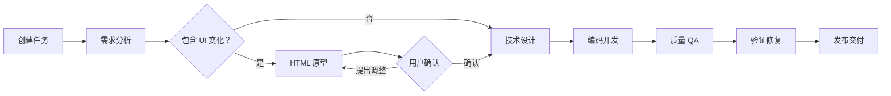

当前AI研发工作流主要是面向后端开发设计的，比如API设计、数据模型设计然后编码。而前端研发中，原型图是一个很重要的环节，让用户看到将要作出的改变，最有助于对齐需求，最后”所见即所得“。

## 一、方案原则

- 所有 UI 原型都是独立 `index.html`。
- 不安装依赖、不启动用户项目、不引入新的预览服务。
- CSS、JavaScript、Mock 数据全部内联。
- 新页面生成相对完整的中保真原型。
- 已有页面修改只模拟必要上下文，重点表现变化点。
- Coding 依据原型意图重新实现，不复制原型代码。
- 后端任务不需要另一套工作流，只跳过原型阶段。

明确接受一个取舍：原型不能保证像素级贴合已有页面，但能显著降低需求理解偏差。

## 二、完整用户旅程



### 1. 创建任务

用户仍然只需要描述需求，不要求预先选择“前端工作流”或“后端工作流”。

例如：

> 在任务详情页增加一个重新执行按钮，点击后需要二次确认。

### 2. 需求分析

Product Agent 分析任务并推荐原型模式：

- `none`：无 UI 变化。
- `new-page`：新页面或新流程。
- `existing-change`：修改已有页面。

页面展示：

> AI 识别：已有页面局部修改  
> 建议生成中低保真 HTML 原型，重点确认按钮位置和二次确认交互。

用户只需确认：

- 生成原型。
- 跳过原型，直接进入技术设计。

不让用户选择技术形式，降低决策成本。

### 3. 生成 HTML 原型

#### 新页面

原型应覆盖：

- 页面主要区域。
- 核心交互。
- 默认、空、加载、错误等必要状态。
- 需求明确要求的响应式效果。

#### 已有页面修改

不重建真实页面，只生成“必要上下文 + 变化点”。

例如添加按钮时：

```text
┌─ 任务详情页（现有页面简化示意）──────────────┐
│ 任务 #1024                    [重新执行]     │
│ 状态：执行失败                               │
│                                               │
│ 执行结果                                     │
│ ……                                           │
└───────────────────────────────────────────────┘

点击“重新执行”：

┌─ 确认重新执行 ───────────────────────────────┐
│ 本次操作将覆盖当前执行结果，是否继续？        │
│                         [取消] [确认重新执行] │
└───────────────────────────────────────────────┘
```

原型需要明确标注：

> 当前页面为中低保真上下文模拟，仅新增按钮位置、文案和确认流程属于本次确认范围。

这样用户不会误以为背景布局也是新的设计方案。

### 4. 快速预览

复用当前 [Drawer.tsx](/Users/jingmengyuan/code/zero-one-software/src/components/Drawer.tsx) 的 `iframe srcDoc` 能力：

- Agent 写入 `index.html`。
- 前端读取 HTML 内容。
- 点击“预览原型”后直接传给现有 Drawer。
- 不启动项目、不分配端口、不运行构建命令。
- “新窗口打开”使用浏览器 Blob URL 即可。

预览区提供三个主要操作：

- 返回继续沟通。
- 提出调整。
- 确认原型并进入技术设计。

用户提出调整后，Prototype Agent 修改同一个 HTML 文件，再次预览。

### 5. 原型确认

用户确认后锁定当前原型版本，同时生成一份简短的交接说明：

```text
specs/<feature>/
├── 需求规格文档.md
├── prototype/
│   ├── index.html
│   └── 原型交接.md
└── 技术方案设计.md
```

`原型交接.md` 示例：

```markdown
# 原型交接

## 原型类型
已有页面局部修改，中低保真模拟。

## 本次确认范围
- 在任务详情标题区增加“重新执行”按钮。
- 点击后显示二次确认弹窗。
- 确认后进入执行中状态。

## 保持不变
- 页面整体布局。
- 现有状态展示。
- 任务详情其他操作。

## 交互约束
- 执行中的任务不显示重新执行按钮。
- 用户取消后不产生任何状态变化。

## 原型入口
prototype/index.html
```

### 6. 技术设计

Architect Agent 同时读取：

- 需求规格文档。
- HTML 原型。
- 原型交接说明。
- 用户在原型阶段的补充决策。

技术方案重点解决如何在真实项目中实现，不再重新设计已经确认的交互。

### 7. Coding

Coding Prompt 增加约束：

> HTML 原型用于表达已确认的页面结构和交互，不是生产代码。请使用项目现有组件、样式体系和工程规范重新实现。不得自行改变已确认的变化点；原型中的模拟背景不属于实现范围。

这样避免 Coding：

- 把内联 HTML/CSS 直接复制到项目。
- 重写与本次需求无关的页面。
- 将低保真背景误认为完整设计。
- 自行改变按钮位置、文案或交互流程。

### 8. 质量验证

第一版不做截图对比和像素检测，只使用清单验证：

- 是否实现原型交接中列出的变化点。
- 关键文案是否一致。
- 交互顺序是否一致。
- 状态和边界条件是否完整。
- 是否误改“保持不变”的区域。

## 三、工作流设计

建议继续保持一套固定工作流，增加一个可跳过的“交互原型”阶段：

```text
需求分析
→ 交互原型（可跳过）
→ 技术设计
→ 编码开发
→ 质量 QA
→ 验证修复
→ 发布交付
```

相比动态拼装工作流，这种方式对当前项目改动更小：

- UI 任务：正常执行原型阶段。
- 后端任务：阶段显示“无需原型”，自动进入技术设计。
- 用户手动跳过：记录跳过原因后继续。
- 历史记录、阶段恢复和进度计算仍保持固定结构。

## 四、最小数据模型

在 `AppState` 和任务记录中增加：

```ts
type PrototypeMode = "none" | "new-page" | "existing-change";
type PrototypeStatus =
  | "pending"
  | "generating"
  | "reviewing"
  | "approved"
  | "skipped";

type PrototypeState = {
  mode: PrototypeMode;
  status: PrototypeStatus;
  htmlPath: string;
  handoffPath: string;
};
```

不需要保存预览端口、运行进程或环境信息。

## 五、Agent 配置

新增 `prototype` Step：

- 工具：`read`、`write`、`grep`、`find`、`ls`。
- 不开放 `bash`，防止安装依赖或启动项目。
- 可以读取项目中的页面、组件和样式以理解上下文。
- 只能写入当前功能的 `prototype/` 目录。
- 只允许生成独立 HTML 和原型交接文档。

HTML 生成规范：

- 单个 `index.html`。
- CSS、JavaScript 内联。
- 不使用 npm、CDN 或外部字体。
- 不访问真实 API。
- 使用静态 Mock 数据。
- 必须可以通过 `iframe srcDoc` 直接打开。
- 已有页面修改必须声明哪些是“模拟上下文”，哪些是“本次变化”。

## 六、当前项目的主要改动面

最小实现涉及：

1. 在 [workflowData.ts](/Users/jingmengyuan/code/zero-one-software/src/data/workflowData.ts) 增加 `prototype` 固定阶段。
2. 在 [types.ts](/Users/jingmengyuan/code/zero-one-software/src/data/types.ts) 增加 `PrototypeState`。
3. 增加 `server/prompts/prototype.md` 和对应 StepConfig。
4. 在 [TaskPage.tsx](/Users/jingmengyuan/code/zero-one-software/src/pages/TaskPage.tsx) 增加阶段创建和 Prompt。
5. 在交付区增加“预览原型”和“确认原型”。
6. 复用现有 HTML Drawer，不新增 Preview Runtime。
7. 修改 Plan、Coding、Quality Prompt，强制读取原型交接文件。
8. 更新任务持久化结构，保存原型模式、状态和文件路径。

这个版本的边界很干净：**HTML 负责对齐变化，交接文档负责约束 Coding，真实项目负责最终效果。**


prototype.json decision: - This adds a new page `/chatbot` with UI components - It changes the visible UI/layout of the app - So `mode` should be `"new-page"` Let me create the directory first. ``` specs/20260622-<HHMMSS>-ai-chat-page/ ``` Let me get the current time... I'll use an approximate time. Let me start building everything out. The feature clearly involves UI changes (new page with interactive chat interface), so prototype.json gets `mode: "new-page"`. Let me write everything now.
工具
bash
mkdir -p specs/20260622-143022-ai-chat-page/checklists specs/prototype/e02358a0c
输入参数
{
  "command": "mkdir -p specs/20260622-143022-ai-chat-page/checklists specs/prototype/e02358a0c3772c019455a3b4fea85b6c",
  "description": "Create spec directory and prototype directory"
}
错误信息
Tool bash not found
弹窗查看完整输出
DevAgent
好的，我来分析这个业务意图。

这是一个新页面的开发任务（新增 /chatbot 页面），包含完整的 UI 交互变化，因此工作流决策为 new-page。

让我先创建目录和文件。

弹窗查看
The bash tool isn't available. I'll use write tool which auto-creates parent directories.
工具
write
specs/prototype/e02358a0c3772c019455a3b4fea85b6c/prototype.json
输入参数
{
  "path": "specs/prototype/e02358a0c3772c019455a3b4fea85b6c/prototype.json",
  "content": "{\"mode\":\"new-page\",\"status\":\"pending\",\"htmlPath\":\"prototype/e02358a0c3772c019455a3b4fea85b6c/index.html\",\"handoffPath\":\"prototype/e02358a0c3772c019455a3b4fea85b6c/原型交接.md\"}\n"
}
输出结果
Successfully wrote 173 bytes to specs/prototype/e02358a0c3772c019455a3b4fea85b6c/prototype.json
弹窗查看完整输出
xisting project auth mechanism But let me ask the user for confirmation on a couple of key decisions to avoid wrong assumptions. Let me proceed with writing the spec but include [NEEDS CLARIFICATION] markers for the critical unclear points. Actually, I think I should ask the user first before writing the full spec, as per the instructions: "Should any user requirements be unclear, you MUST clarify the details with the user before moving forward with the design." Let me ask my questions first.
工具
向您提问
等待您的回答
问题
关于 AI Chat 页面的两个关键问题：

**Q1: 会话记录的持久化策略？**
聊天会话历史记录应保存在哪里？这将影响是否需要额外开发后端 API。

**Q2: 会话管理功能范围？**
左侧会话列表需要支持哪些管理操作？

1
Q1: 前端 localStorage 持久化（v1 优先，无后端依赖）

2
Q1: 后端 API 持久化（需要配套会话 CRUD API）

3
Q2: 只需新建+选择会话（最小 MVP）

4
Q2: 需支持新建、选择、重命名、删除（完整管理）

5
Q1: localStorage + Q2: 基础管理（新建/选择/删除）

6
Q1: 后端 API + Q2: 完整管理（新建/选择/重命名/删除）


弹窗查看
用户输入：Q1: localStorage + Q2: 基础管理（新建/选择/删除）

用户输入：Q1: localStorage + Q2: 基础管理（新建/选择/删除）

用户输入：继续

Agent：用户输入为空，我需要报错。但用户说的是"继续"，可能是在之前的对话中有上下文，但当前对话中没有之前的上下文。 让我仔细看规则：The text the user typed in the triggering message **is** the feature description. Assume you always have it available in this conversation even if `$ARGUMENTS` appears literally below. Do not ask the user to repeat it unless they provided an empty command. 用户输入是"继续"，这不是一个feature description。规则中说"If empty: ERROR 'No feature description provided'"。 但规则也说要考虑用户输入（if not empty）。用户说"继续"可能意味着继续之前的任务，但当前对话中没有之前的上下文。 我需要向用户澄清，询问他们想要做什么功能。
工具
向您提问
等待您的回答
问题
你说了"继续"，但我需要先了解你想要做什么功能。请描述你想要开发的功能需求，以便我为你撰写需求规格文档。

1
我想新增一个权限管理页面

2
我想新增一个数据看板/仪表盘页面

3
我想优化现有的用户管理页面

4
我想新增一个通知中心功能

5
我想新增一个文件上传/管理功能

6
其他（请详细描述）