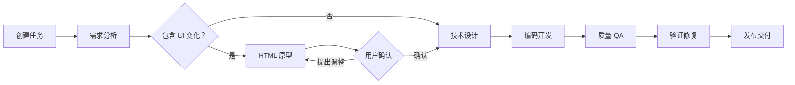

# 交互原型阶段逻辑分析

> 生成日期：2026-06-24

## 一、概述

交互原型（prototype）是 AI 原生研发平台 SOP 工作流中的**可选第 2 步**，位于需求分析（intent）之后、技术设计（plan）之前。其核心目的是：当需求涉及 UI 变化时，通过生成中低保真 HTML 原型让用户在编码前确认页面结构和交互流程，降低需求理解偏差。

## 二、工作流中的位置

```
intent → [prototype?] → plan → coding → quality → verify → release
```

- prototype 步骤**默认不启用**，由 intent 阶段的 Agent 判断需求是否包含 UI 变化后动态决定
- 判断结果写入 `specs/prototype/{sessionId}/prototype.json`
- 前端读取该文件后，通过 `getTaskWorkflow()` 动态决定工作流是否包含 prototype 步骤

## 三、核心数据模型

### PrototypeState

```typescript
type PrototypeMode = "none" | "new-page" | "existing-change";
type PrototypeStatus = "pending" | "generating" | "reviewing" | "approved" | "skipped";

type PrototypeState = {
  mode: PrototypeMode;       // UI 变化类型
  status: PrototypeStatus;   // 原型状态
  htmlPath: string;          // 原型 HTML 文件路径
  handoffPath: string;       // 原型交接文档路径
};
```

### prototype.json 文件

存储在 `specs/prototype/{sessionId}/prototype.json`，示例：

```json
{
  "mode": "new-page",
  "status": "pending",
  "htmlPath": "prototype/{sessionId}/index.html",
  "handoffPath": "prototype/{sessionId}/原型交接.md"
}
```

## 四、完整用户旅程



### 步骤详解

#### 1. 需求分析阶段（intent）

Product Agent 分析用户需求后，判断是否包含 UI 变化，写入 `prototype.json`：

- `mode: "none"` — 无 UI 变化，跳过原型阶段
- `mode: "new-page"` — 新页面或新流程
- `mode: "existing-change"` — 修改已有页面

#### 2. 原型决策读取

`TaskPage.tsx` 中的 `readPrototypeDecision()` 调用 HTTP 接口 `/specs-file` 读取 `prototype.json`，解析出 `PrototypeState` 并更新到 `AppState.prototype`。

#### 3. 工作流动态调整

`workflowData.ts` 的 `getTaskWorkflow()` 根据 `prototype.mode !== "none" && prototype.status !== "skipped"` 决定是否包含 prototype 步骤：

```typescript
export function getTaskWorkflow(prototype?: PrototypeState): WorkflowStep[] {
  if (prototype && prototype.mode !== "none" && prototype.status !== "skipped") {
    return workflow; // 包含 prototype 步骤的完整 7 步工作流
  }
  return workflow.filter((s) => s.id !== "prototype"); // 跳过 prototype
}
```

#### 4. 原型生成（prototype 阶段）

Prototype Agent 根据 stepConfig 配置执行：

- **工具白名单**：`read`、`write`、`grep`、`find`、`ls`（不开放 `bash`，防止安装依赖或启动项目）
- **输出约束**：
  - 只能写入当前任务的 `prototype/` 目录
  - 生成独立 `index.html`（CSS、JavaScript、Mock 数据全部内联）
  - 生成 `原型交接.md`（确认范围、不变区域、交互约束）
  - 更新 `prototype.json` 状态为 `"reviewing"`
- **HTML 规范**：
  - 单个 `index.html`，不依赖 npm/CDN/外部字体
  - 不访问真实 API，使用静态 Mock 数据
  - 必须可通过 `iframe srcDoc` 直接打开
  - 已有页面修改必须标注"模拟上下文"与"本次变化"

#### 5. 用户预览与确认

`DecisionBoard.tsx` 的 `DeliveryCollabTab` 在 prototype 步骤完成时渲染 `<PrototypePreview>` 组件：

- 通过 iframe 嵌入生成的 `index.html`
- 提供三个操作：
  - **返回继续沟通** — 回到任务轨迹与 Agent 对话
  - **提出调整** — Agent 修改同一个 HTML 文件，再次预览
  - **确认原型** — 锁定原型版本，进入技术设计
- 确认后更新 `prototype.status` 为 `"approved"`
- 跳过则设为 `"skipped"`

#### 6. 技术设计阶段（plan）

Architect Agent 同时读取：

- 需求规格文档
- HTML 原型
- 原型交接文档
- 用户在原型阶段的补充决策

#### 7. 编码开发阶段（coding）

Coding Prompt 增加约束：

> HTML 原型用于表达已确认的页面结构和交互，不是生产代码。请使用项目现有组件、样式体系和工程规范重新实现。不得自行改变已确认的变化点；原型中的模拟背景不属于实现范围。

## 五、关键代码路径

### 前端

| 文件 | 职责 |
|------|------|
| `src/data/types.ts` | 定义 `PrototypeState`、`PrototypeMode`、`PrototypeStatus` 类型 |
| `src/data/workflowData.ts` | `getTaskWorkflow()` 动态计算工作流是否包含 prototype |
| `src/pages/TaskPage.tsx` | `readPrototypeDecision()` 读取 prototype.json，管理原型状态流转 |
| `src/components/DecisionBoard.tsx` | `DeliveryCollabTab` 中的 `<PrototypePreview>` 组件 |
| `src/components/PrototypePreview.tsx` | iframe 嵌入原型 HTML，提供确认/跳过操作 |

### 服务端

| 文件 | 职责 |
|------|------|
| `server/stepConfigs.ts` | prototype 步骤的 Agent 配置（模型、工具、thinking level） |
| `server/prompts/prototype.md` | Prototype Agent 的系统提示词 |
| `server/httpRoutes.ts` | `/specs-file` 接口提供 prototype.json 和原型文件的读取 |
| `server/handlers/session.handler.ts` | prototype 步骤的 session 创建和管理 |

## 六、数据流

```
用户输入需求
  → intent Agent 分析
    → 判断是否含 UI 变化
    → 写入 specs/prototype/{sessionId}/prototype.json
  → TaskPage 读取 prototype.json
    → 更新 AppState.prototype
    → getTaskWorkflow() 重新计算工作流
  → 用户点击"继续"
    → 进入 prototype 阶段
    → Prototype Agent 生成 index.html + 原型交接.md
    → 更新 prototype.json status → "reviewing"
  → 用户预览确认
    → status → "approved"
    → 进入 plan 阶段
  → 用户跳过
    → status → "skipped"
    → getTaskWorkflow() 过滤掉 prototype 步骤
    → 进入 plan 阶段
```

## 七、当前实现状态

### 已实现

- ✅ `PrototypeState` 类型定义
- ✅ `getTaskWorkflow()` 动态工作流计算
- ✅ `prototype.json` 的读写（通过 `/specs-file` HTTP 接口）
- ✅ Prototype Agent 的 stepConfig 和 prompt
- ✅ 原型预览组件（iframe 嵌入）
- ✅ 确认/跳过操作
- ✅ 交付面板的结构化总结展示

### 待完善

- `stageContent.ts` 中的 `getPrototypeContent()` 是静态 mock 数据，实际运行时会被 Agent 真实产出覆盖
- 原型确认后的"交接"到 plan 阶段的数据传递（`handoffPath` 中的约束信息）目前通过 prompt 文本传递，没有结构化的契约接口
- 跳过原型时（`status: "skipped"`），`getTaskWorkflow()` 过滤掉 prototype 步骤后，`stepIndex` 的连续性需要保证（当前 `continueTask` 中 `nextIndex = stepIndex + 1`，跳过时 index 会跳过一个位置）
- 原型预览的 iframe 嵌入依赖 `specs/prototype/{sessionId}/index.html` 文件的实际存在

## 八、设计原则

1. **HTML 负责对齐变化** — 原型是沟通工具，不是生产代码
2. **交接文档负责约束 Coding** — 明确"变化范围"和"保持不变"的边界
3. **真实项目负责最终效果** — Coding 阶段使用项目现有组件和样式重新实现
4. **后端任务自动跳过** — 无 UI 变化时 prototype 步骤不出现
5. **零额外基础设施** — 不启动新服务、不分配端口、不运行构建命令
