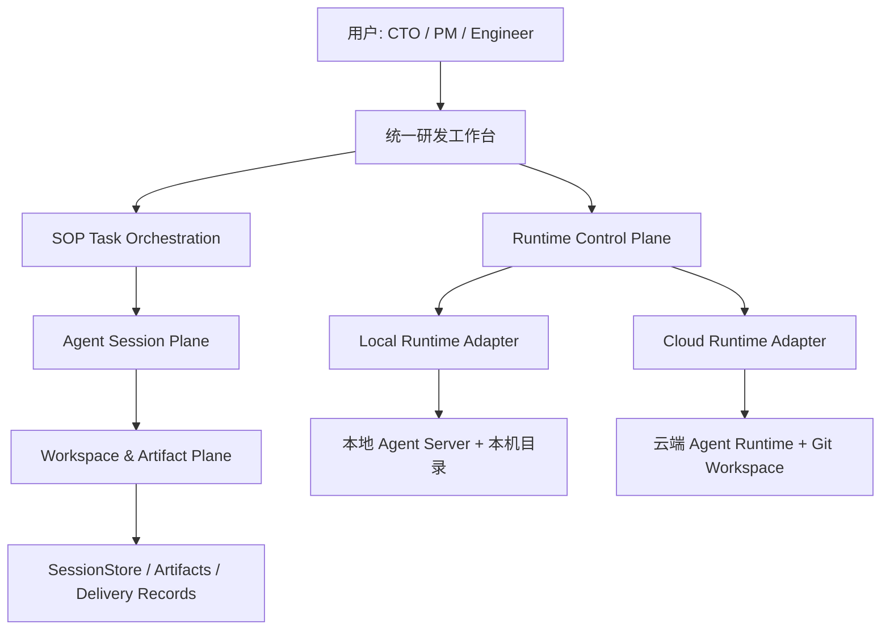

# Local-Cloud Hybrid 模式产品与技术评审报告

日期：2026-06-03

## 结论摘要

Local-Cloud Hybrid 最好的表达不是“两套产品”，而是“同一个 AI 原生研发工作台，任务可选择最合适的 Agent Runtime 执行”。本地模式承担贴近代码、低延迟、强隐私的快速执行；云端模式承担长任务、远程持续运行、团队协作和资源托管；Hybrid 的真正价值在于任务可以在两者之间交接，而不是只在启动前二选一。

当前代码已经具备 Hybrid 的雏形：前端有 runtime connector 抽象，Agent WebSocket URL 可按模式切换，服务端支持本地外部目录与云端 git clone workspace，会话也有主存储与 workspace 镜像。但当前实现还存在几个影响演示可信度的断点：`/task` 没有挂 `RuntimeProvider`、云端管理 REST API 尚未在服务端实现、运行时项目模型和真实 Agent 会话模型未统一、云端连接重连与资源轮询存在重复机制。

建议下一轮优先做“体验闭环”和“概念对齐”：让任务启动、任务执行、历史恢复、运行时管理都使用同一个 runtime 状态；让云端项目列表能映射真实 session/task；补齐云端资源和项目 API；并加入启动前 preflight，让用户明确知道本次任务为什么适合本地或云端。

## 分析假设

- 本报告基于静态代码阅读，没有执行构建和运行验证。
- 产品目标是 CTO 和投资人演示，因此优先考虑“真实可体验、概念清晰、风险可解释”。
- 当前 Local-Cloud Hybrid 处于原型期，允许存在模拟指标，但关键路径需要闭合。
- 不建议为了云端模式拆出第二套任务页面，除非未来出现完全不同的协作或权限模型。

## 推荐产品架构

### 核心产品叙事

推荐用一句话解释：

> 01 是一个 AI 原生研发平台，任务在统一 SOP 工作台中推进，背后的 Agent Runtime 可以运行在本地，也可以运行在云端，并在需要时交接。

这比“本地 Agent + 云端 Agent”更强，因为它把用户价值从部署形态提升为任务连续性：

- 本地：靠近本机仓库、文件系统和开发工具，适合快速试错、私有代码、小步交互。
- 云端：独立算力、长时间在线、可远程恢复，适合长任务、定时任务、团队可见和交付流水线。
- Hybrid：本地启动后云端接管，或云端完成后本地拉取检查，让任务生命周期不被机器状态绑定。

### 推荐分层

关键边界：

- Runtime Control Plane：负责模式、连接、资源、认证、preflight、项目索引。
- Task Orchestration：负责任务、SOP 步骤、用户决策、Agent 事件流。
- Workspace & Artifact Plane：负责本地路径、云端 clone、产物、diff、session 镜像。
- Runtime Adapter：隔离本地和云端差异，让页面只关心“当前 runtime 能否执行”。

### 推荐模式

1. Local Fast Lane
   - 默认适合：已有本地仓库、需要快速读取/编辑文件、演示低延迟交互。
   - 用户感知：选择本机目录，Agent 直接读写本地 workspace。
   - 产品承诺：快、近、私有。

2. Cloud Continuity
   - 默认适合：用户只提供 Git 仓库、任务较长、希望离开页面后继续执行。
   - 用户感知：输入 repo、branch、可选子目录，云端准备 workspace 后开始。
   - 产品承诺：持续、托管、可协作。

3. Hybrid Handoff
   - 这是最值得投资人记住的高级能力。
   - Local to Cloud：本地完成意图和方案，云端接管 coding/quality/release。
   - Cloud to Local：云端生成分支或 patch，本地拉取、预览、验证。
   - 产品承诺：任务跟随上下文，不跟随机器。

## 推荐用户旅程

### 首次启动

1. 用户在落地页选择运行方式。
2. 系统展示一句明确建议：例如“检测到本地 Agent 已连接，适合快速操作本机目录”或“云端运行适合长任务和远程托管”。
3. 进入 Dashboard，顶部状态不是单纯“本地/云端”，而是“当前 Runtime 可执行/需配置/不可用”。

### 创建任务

1. 用户输入一句话需求或选择任务卡片。
2. 系统做 runtime preflight：
   - 本地：Agent Server、API Key、workspace 可读写、路径有效。
   - 云端：Agent Runtime、token、repo 可访问、branch 存在、资源额度。
3. 用户确认 workspace：
   - 本地模式选择目录。
   - 云端模式输入 Git URL、branch、可选 subdirectory。
4. 进入统一 TaskPage，SOP 不因模式改变。

### 任务执行

1. SopNav 显示当前 Runtime、连接状态、延迟或队列状态。
2. DecisionBoard 展示 Agent 输出、工具调用、待决策项。
3. LeftPanel 展示真实 workspace 文件树。
4. 在长任务节点，允许“交给云端继续”。

### 历史恢复

1. 历史记录按任务展示，不按 runtime 割裂。
2. 每条记录展示当时运行模式、workspace 来源、最后产物。
3. 恢复时先检查原 runtime 是否可用：
   - 可用：直接恢复。
   - 不可用：提示切换 runtime 或从 artifact/git 重新建立 workspace。

### 投资人演示路径

推荐演示顺序：

1. Landing 选择云端，强调 7x24 和不占本机资源。
2. 输入 Git 仓库和需求，进入统一 SOP。
3. 展示 Agent 流式执行和文件树变化。
4. 切到运行时管理中心，展示云端任务、资源、历史记录。
5. 再切本地模式，展示同一工作台可贴近本机目录执行。
6. 收束到 Hybrid：任务不是聊天记录，而是可恢复、可交接、可交付的软件生产过程。

## 当前代码现状

### 已经做得好的部分

- 已有 runtime 类型抽象：`src/types/runtime.ts` 定义了 `RuntimeMode`、`RuntimeStatus`、`IRuntimeConnector`、项目和资源指标模型。
- 已有 connector 工厂：`src/connectors/index.ts` 通过 `switchRuntime(from, to)` 管理本地和云端 connector。
- Agent WebSocket 已支持按模式构造 URL：`src/agent/config.ts` 读取 `VITE_CLOUD_AGENT_WS_URL` / `VITE_LOCAL_AGENT_WS_URL`。
- Task 启动能记录运行模式：`src/pages/DashboardPage.tsx` 在创建任务时写入 `runtimeMode`，云端模式能把 Git URL 和 branch 写入 `gitRepo`。
- 服务端 workspace 已有三种形态：托管 workspace、本地外部目录、云端 git clone，核心在 `server/WorkspaceManager.ts`。
- 会话存储已经向“可恢复资产”靠拢：`server/SessionStore.ts` 同时保存主存储和 workspace 镜像。
- UI 已有运行时状态表达：Landing、Dashboard、TaskPage、History 都已经出现本地/云端标识。

### 主要问题与风险

#### P0：TaskPage 没有 RuntimeProvider，任务执行页可能使用默认 runtime

`src/App.tsx` 中 `/dashboard` 和 `/agent` 被 `RuntimeProvider` 包裹，但 `/task` 没有。`TaskPage` 内部调用 `useRuntimeState()`，如果没有 Provider，会读到 context 默认值，而不是用户在 Landing 或 Dashboard 选择的模式。

影响：

- 云端任务进入 `/task` 后可能仍按默认 local 模式连接 Agent。
- `AgentStatusBadge` 可能展示错误模式。
- 历史恢复时 runtimeMode 和实际连接 runtime 可能不一致。

建议：

- 把 `RuntimeProvider` 提升到 `BrowserRouter` 内、`Routes` 外，覆盖所有页面。
- 或至少包裹 `/task`。
- 同时让 `TaskPage` 优先使用 `state.runtimeMode`，再与 runtime store 做同步校验。

#### P0：CloudRuntimeConnector 调用的 REST API 服务端尚未实现

`src/connectors/CloudRuntimeConnector.ts` 调用了：

- `GET /api/resources`
- `GET /api/projects`
- `POST /api/projects`
- `DELETE /api/projects/:id`
- `POST /api/projects/:id/start`
- `POST /api/projects/:id/pause`

但 `server/index.ts` 当前没有这些 `/api/*` 路由。结果是云端运行时管理中心会拿到空项目列表和默认资源值，无法证明云端“全天候服务”和“项目托管”。

建议：

- 短期：实现最小 REST API，直接映射 `SessionStore.list()` 和当前进程资源。
- 中期：引入 `RuntimeProjectStore`，把 task/session/workspace/gitRepo/phase/progress 统一为 Cloud Project。
- 长期：接入队列、额度、团队权限和后台任务状态。

#### P0：运行时项目模型与真实任务会话模型割裂

`RuntimeStore.projects` 维护的是 `AgentProject[]`，Local connector 存在 `localStorage`，Cloud connector 期望 REST 项目 API。但真实任务历史存在 `SessionStore`，真实执行存在 `SessionPool` 和 `useAgent.sessions`。

影响：

- `/agent` 管理中心里的“项目”不等于用户在 `/dashboard` 创建并执行的任务。
- 投资人看到运行时项目列表时，可能无法对应到真实 SOP 交付记录。
- 后续做云端长任务、恢复、暂停、继续时会重复建模型。

建议：

- 统一领域语言：建议用 `RuntimeTask` 或 `AgentRun` 作为运行实体，包含 `sessionId`、`taskId`、`runtimeMode`、`workspaceRef`、`phase`、`progress`、`lastEventAt`。
- `/agent` 项目列表直接展示这些真实运行实体。
- `AgentProject` 可保留为 UI view model，但数据源必须来自真实 task/run。

#### P1：云端连接有双重重连机制

`AgentWebSocket` 已经有心跳、重连和重连次数；`CloudRuntimeConnector` 又实现了 `ReconnectManager`，在 `onClose` 后再次调用 `this.connect()`。

影响：

- 可能创建多个 WebSocket 实例。
- 状态回调重复触发。
- 云端长时间运行时更容易出现连接状态抖动。

建议：

- 只保留一层重连。优先让 `AgentWebSocket` 负责连接生命周期。
- `CloudRuntimeConnector` 只订阅 open/close/reconnecting/status，并转成 `RuntimeStatus`。

#### P1：RuntimeStore 切换和轮询容易重复

`RuntimeProvider` 初始化 effect 会根据 `state.mode` 调用 `switchRuntime(null, state.mode)`，`switchMode()` 内也会调用 `switchRuntime(state.mode, mode)`，随后 `SET_MODE` 又触发 effect。再叠加 connector 自身也可能轮询资源，容易出现重复连接、重复 handler 和重复 interval。

建议：

- 让模式切换只有一个入口：effect 监听 mode 并负责连接，`switchMode` 只 dispatch mode。
- 或让 `switchMode` 负责连接，effect 只做首次 mount。
- 保存 connector 的 unsubscribe，并在切换时清理 status/resource handlers。
- 资源轮询只放在 store 或 connector 一处，不要两边同时做。

#### P1：环境变量命名不一致

README 仍写 `VITE_AGENT_WS_URL` / `VITE_AGENT_SECRET`，代码已经改成：

- `VITE_LOCAL_AGENT_WS_URL`
- `VITE_LOCAL_AGENT_SECRET`
- `VITE_CLOUD_AGENT_WS_URL`
- `VITE_CLOUD_AGENT_SECRET`
- `VITE_CLOUD_API_URL`

建议：

- 更新 README 和部署文档。
- 保留旧变量 fallback，降低迁移成本。
- 在 UI 的环境配置里展示当前读取到的 runtime endpoint。

#### P1：云端 git clone 使用 shell 字符串，存在安全与鲁棒性问题

`WorkspaceManager.initCloudWorkspace()` 使用 `execSync` 拼接 `git clone --branch "${branch}" "${url}"`。对于云端 runtime，Git URL 和 branch 是用户输入，建议避免 shell 字符串。

建议：

- 改为 `spawnSync("git", ["clone", "--depth", "1", "--branch", branch, url, repoDir])`。
- 对 URL scheme、branch 名称、subdirectory 做校验。
- 支持私有仓库 token 时，不把 token 写入日志。

#### P1：文件系统能力需要按 runtime 收敛权限

当前 `workspace.readFile` 支持绝对路径读取，`workspace.browse` 支持浏览任意目录。这对本地原型很方便，但云端部署后需要更清晰的权限边界。

建议：

- 本地模式：允许用户授权后浏览本机目录。
- 云端模式：只允许访问该 task 的 workspace 根目录。
- 前端也应在云端模式隐藏“浏览本机目录”类交互。

#### P2：历史恢复不会自动切换运行时

`handleContinueFromHistory()` 会把 `fullRecord.runtimeMode` 写回 AppState，但没有显式调用 runtime store 的 `switchMode()`。`useSessionRecords()` 也只在 mount 时从 localStorage 读取一次 runtime mode。

建议：

- 历史恢复时先切 runtime，再进入 `/task`。
- `useSessionRecords(runtimeMode)` 接收明确模式，避免隐式读 localStorage。
- 历史记录加载失败时给出“当前 runtime 不可用”的明确状态。

#### P2：云端 workspace 交付缺少 git 回写或 artifact 下载闭环

服务端能 clone repo，也能让 Agent 修改文件，但目前没有看到 commit、push、patch 下载或 artifact 打包的产品路径。

建议：

- 最小闭环：生成 patch/diff，可下载或复制到本地。
- 标准闭环：创建 cloud branch，commit 变更，生成 PR 链接。
- 演示闭环：在 release 步骤展示变更摘要、文件列表、diff、交付包。

## 建议路线图

### 第一阶段：修闭环，适合 1 到 2 天

- 将 `RuntimeProvider` 提升到 App 根部，确保 Landing、Dashboard、Task、AgentDashboard 使用同一 runtime 状态。
- 补齐 README 和部署文档中的 runtime 环境变量。
- 实现最小 `/api/resources` 和 `/api/projects`，先映射 SessionStore，避免云端管理中心空转。
- 移除 CloudRuntimeConnector 的二次重连，统一由 AgentWebSocket 管理。
- 在 WorkspaceSelector 云端模式加入 repo/branch/subdirectory 的 preflight。

验收标准：

- Landing 选择云端后，Dashboard、TaskPage、History、AgentDashboard 都显示云端。
- 云端输入 repo 后能进入任务，服务端 clone 成功后左侧文件树可展示真实仓库。
- `/agent` 能看到至少一条由真实任务产生的运行记录。

### 第二阶段：统一运行实体，适合 3 到 5 天

- 引入 `RuntimeTask` 数据模型，统一 `AgentProject`、`SessionMeta`、`AppState` 的重复字段。
- `/agent` 管理中心改为真实运行任务视图，支持按 runtime、phase、更新时间筛选。
- 历史恢复时执行 runtime preflight 和自动切换。
- 保存 `gitRepo`、`workspaceRef`、`runtimeEndpoint` 到 SessionMeta。
- 建立 runtime adapter 测试，覆盖 local/cloud 的 connect/list/create/start/pause。

验收标准：

- 任意任务都能从历史恢复到正确 runtime。
- 管理中心的项目卡片能进入对应任务或查看产物。
- 本地和云端的任务记录字段一致。

### 第三阶段：做出 Hybrid Handoff，适合 1 到 2 周

- Local to Cloud：把当前 workspace 打包或推送到临时 branch，云端继续执行后续 SOP。
- Cloud to Local：云端生成 patch、branch 或 PR，本地可拉取继续。
- 引入后台 job 状态：queued、preparing、running、waiting_user、completed、failed。
- 增加通知机制：云端任务完成后在 Dashboard 和 History 中提示。
- 引入成本和资源可视化：token、运行时长、队列等待、失败重试。

验收标准：

- 本地任务可在 coding 前交给云端继续。
- 云端任务完成后，本地可查看 diff 或拉取分支。
- 页面关闭后，云端任务状态仍可恢复。

## 产品细节建议

- Landing 上不要只让用户“选模式”，而要让用户理解“为什么选”。例如根据任务类型给出建议标签：快速本地改造、长任务云端托管、团队共享云端。
- Dashboard 顶部状态建议从“本地/云端 · 已连接”升级为“当前执行环境”，点击可展开 preflight 详情。
- WorkspaceSelector 云端模式建议增加：
  - Git URL
  - branch
  - subdirectory
  - access token 或凭证状态
  - clone preflight 结果
- TaskPage 的空态文案应按模式变化：
  - 本地：请启动本地 Agent Server。
  - 云端：云端 Runtime 正在唤醒或认证失败。
- History 里的 runtime 标识建议可点击，展开显示当时的 workspace 来源和恢复策略。
- AgentDashboard 建议从“项目 CRUD”转向“运行任务与资源治理”，更贴近 AI 原生研发平台。

## 技术治理建议

- 把 runtime mode 从 localStorage 隐式状态提升为显式应用状态，减少 `zero-one-runtime-mode` 与 `AppState.runtimeMode` 分叉。
- `useAgent()`、`useSessionRecords()`、`RuntimeStore` 都应接收同一 runtime context，不要各自读 localStorage。
- WebSocket 请求协议可以加入 `runtimeMode`、`sessionId`、`workspaceRef`，便于服务端审计和恢复。
- 云端 HTTP API 需要和 WebSocket 使用同一认证策略，不能只保护 WebSocket。
- WorkspaceManager 需要区分 trusted local 和 remote tenant workspace。
- 长任务需要服务端持久运行实体，不能只依赖前端页面存活和 `SessionPool` 内存状态。
- 逐步减少 console 调试日志，替换为结构化 task/run 日志，方便演示云端可观测性。

## 推荐北极星指标

- Time to First Agent Action：用户点击开始到 Agent 第一次有效输出的时间。
- Runtime Recovery Rate：历史任务恢复成功率。
- Cloud Continuity Rate：页面关闭后云端任务继续并完成的比例。
- Human Decision Compression：Agent 原始输出被压缩成结构化待决策项的比例。
- Delivery Artifact Completeness：每次任务是否有 spec、diff、build result、release summary。

## 最小产品验收清单

- 用户能明确选择本地或云端，并在所有页面看到一致状态。
- 本地模式能选择本地目录并完成 SOP 至少前三步。
- 云端模式能输入 Git 仓库，服务端 clone 后执行 SOP。
- 历史记录能显示 runtime mode，并能恢复到正确 runtime。
- AgentDashboard 展示真实任务，而不是孤立 mock/localStorage 项目。
- 云端任务至少能产出 diff 或 artifact，不止停留在对话流。

